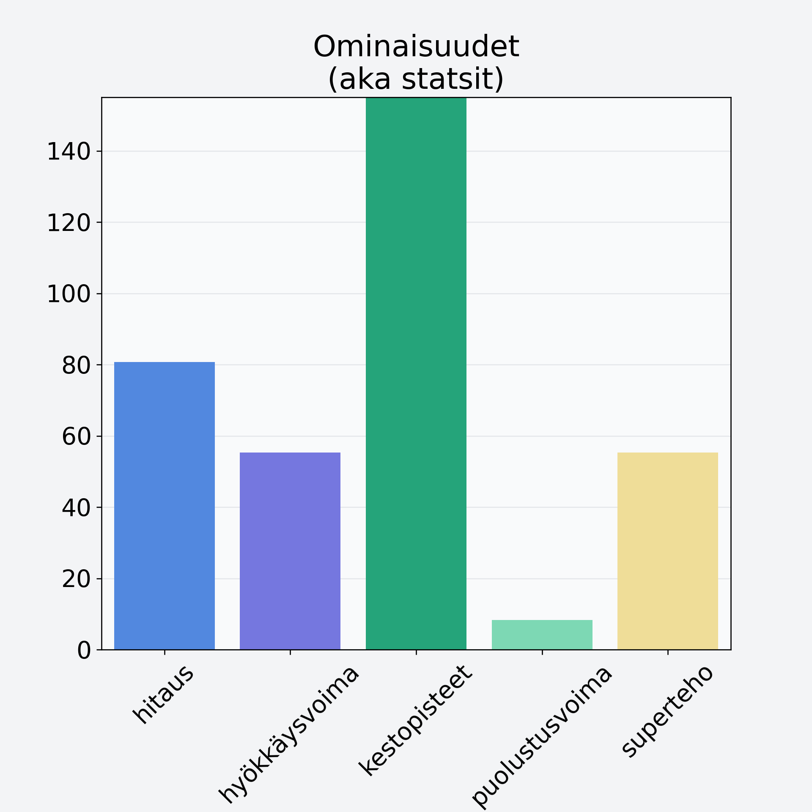

# Ananas, kuivattu, jogurttikuorrutus

## Kilpailijan tiedot { data-search-exclude }

:octicons-shield-check-24:{ .shieldMarker } Kilpailija on Finelin hyväksymä.

{ loading=lazy }

## Lisätiedot { data-search-exclude }
=== "Statsit numeerisena"

     | Voima          |   Arvo |
     |:---------------|-------:|
     | hitaus         |  80.72 |
     | hyökkäysvoima  |  55.34 |
     | kestopisteet   | 417.94 |
     | puolustusvoima |   8.34 |
     | superteho      |  55.34 |

=== "Samankaltaisia kilpailijoita"
    [Ananas, kuivattu, jogurttikuorrutus](/ananas-kuivattu-jogurttikuorrutus){ .md-button .md-button--primary .similarProduct }
    [Banaanilastu, kuivattu banaani](/banaanilastu-kuivattu-banaani){ .md-button .md-button--primary .similarProduct }
    [Vesimeloni, kuorittu](/vesimeloni-kuorittu){ .md-button .md-button--primary .similarProduct }
    [Papaija, kuorittu](/papaija-kuorittu){ .md-button .md-button--primary .similarProduct }

!!! info inline start "Huomio"

    Hyökkäysvoima vaihtelee eri sotureilla :)
