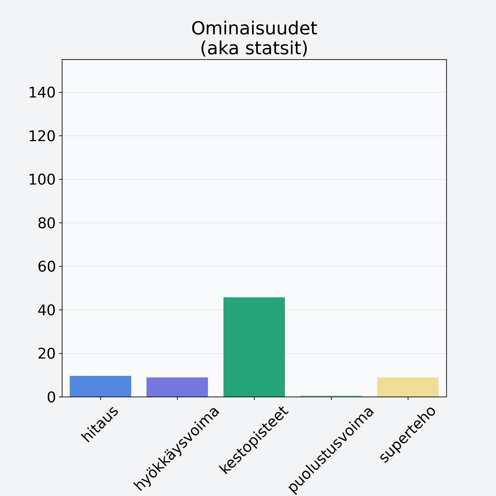

# Appelsiini, kuorittu

## Kilpailijan tiedot { data-search-exclude }

:octicons-shield-check-24:{ .shieldMarker } Kilpailija on Finelin hyväksymä.

{ loading=lazy }

## Lisätiedot { data-search-exclude }
=== "Statsit numeerisena"

     | Voima          |   Arvo |
     |:---------------|-------:|
     | hitaus         |   9.6  |
     | hyökkäysvoima  |   8.9  |
     | kestopisteet   |  45.68 |
     | puolustusvoima |   0.56 |
     | superteho      |   8.9  |

=== "Samankaltaisia kilpailijoita"
    [Sitruuna, kuorittu](/sitruuna-kuorittu){ .md-button .md-button--primary .similarProduct }
    [Mandariini, kuorittu](/mandariini-kuorittu){ .md-button .md-button--primary .similarProduct }
    [Mandariini, keskiarvo, punnittu kuorineen](/mandariini-keskiarvo-punnittu-kuorineen){ .md-button .md-button--primary .similarProduct }
    [Greippi, keskiarvo, punnittu kuorineen](/greippi-keskiarvo-punnittu-kuorineen){ .md-button .md-button--primary .similarProduct }
    [Sitruuna, keskiarvo, punnittu kuorineen](/sitruuna-keskiarvo-punnittu-kuorineen){ .md-button .md-button--primary .similarProduct }

!!! info inline start "Huomio"

    Hyökkäysvoima vaihtelee eri sotureilla :)
