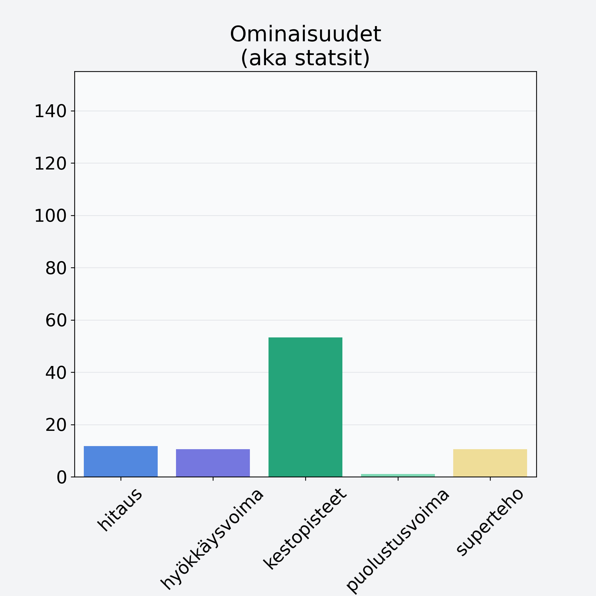

# Aprikoosi, keskiarvo, kivetön

## Kilpailijan tiedot { data-search-exclude }

:octicons-shield-check-24:{ .shieldMarker } Kilpailija on Finelin hyväksymä.

{ loading=lazy }

## Lisätiedot { data-search-exclude }
=== "Statsit numeerisena"

     | Voima          |   Arvo |
     |:---------------|-------:|
     | hitaus         |  11.76 |
     | hyökkäysvoima  |  10.6  |
     | kestopisteet   |  53.27 |
     | puolustusvoima |   1.06 |
     | superteho      |  10.6  |

=== "Samankaltaisia kilpailijoita"
    [Aprikoosi, keskiarvo, kivetön](/aprikoosi-keskiarvo-kiveton){ .md-button .md-button--primary .similarProduct }
    [Aprikoosi, keskiarvo, punnittu kivineen](/aprikoosi-keskiarvo-punnittu-kivineen){ .md-button .md-button--primary .similarProduct }

!!! info inline start "Huomio"

    Hyökkäysvoima vaihtelee eri sotureilla :)
