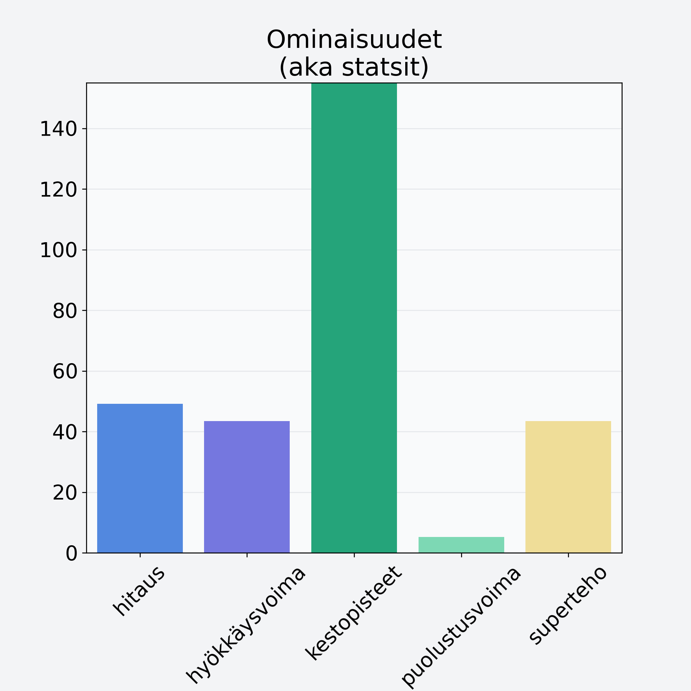

# Aprikoosi, kuivattu

## Kilpailijan tiedot { data-search-exclude }

:octicons-shield-check-24:{ .shieldMarker } Kilpailija on Finelin hyväksymä.

{ loading=lazy }

## Lisätiedot { data-search-exclude }
=== "Statsit numeerisena"

     | Voima          |   Arvo |
     |:---------------|-------:|
     | hitaus         |  49.1  |
     | hyökkäysvoima  |  43.4  |
     | kestopisteet   | 220.6  |
     | puolustusvoima |   5.19 |
     | superteho      |  43.4  |

=== "Samankaltaisia kilpailijoita"
    [Päärynä, kuorittu](/paaryna-kuorittu){ .md-button .md-button--primary .similarProduct }
    [Aprikoosi, kuivattu](/aprikoosi-kuivattu){ .md-button .md-button--primary .similarProduct }

!!! info inline start "Huomio"

    Hyökkäysvoima vaihtelee eri sotureilla :)
