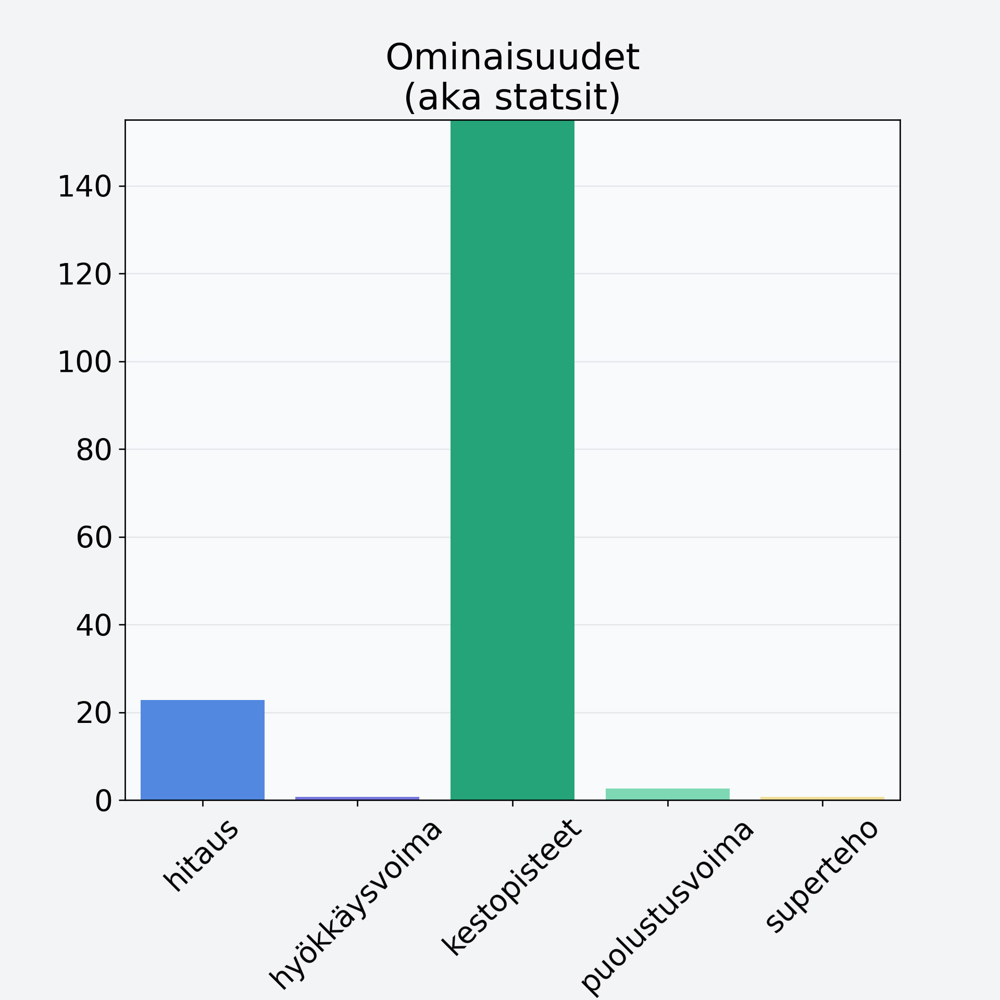

# Avokado, kuorittu, kivetön

## Kilpailijan tiedot { data-search-exclude }

:octicons-shield-check-24:{ .shieldMarker } Kilpailija on Finelin hyväksymä.

{ loading=lazy }

## Lisätiedot { data-search-exclude }
=== "Statsit numeerisena"

     | Voima          |   Arvo |
     |:---------------|-------:|
     | hitaus         |  22.8  |
     | hyökkäysvoima  |   0.77 |
     | kestopisteet   | 198.18 |
     | puolustusvoima |   2.63 |
     | superteho      |   0.66 |

=== "Samankaltaisia kilpailijoita"
    [Sekahedelmä, kuivattu](/sekahedelma-kuivattu){ .md-button .md-button--primary .similarProduct }
    [Papaija, kuorittu](/papaija-kuorittu){ .md-button .md-button--primary .similarProduct }
    [Sharon, kaki, persimon](/sharon-kaki-persimon){ .md-button .md-button--primary .similarProduct }
    [Erikoishedelmä, eksoottinen, keskiarvo, mango/papaija, kuivattu](/erikoishedelma-eksoottinen-keskiarvo-mango-papaija-kuivattu){ .md-button .md-button--primary .similarProduct }

!!! info inline start "Huomio"

    Hyökkäysvoima vaihtelee eri sotureilla :)
