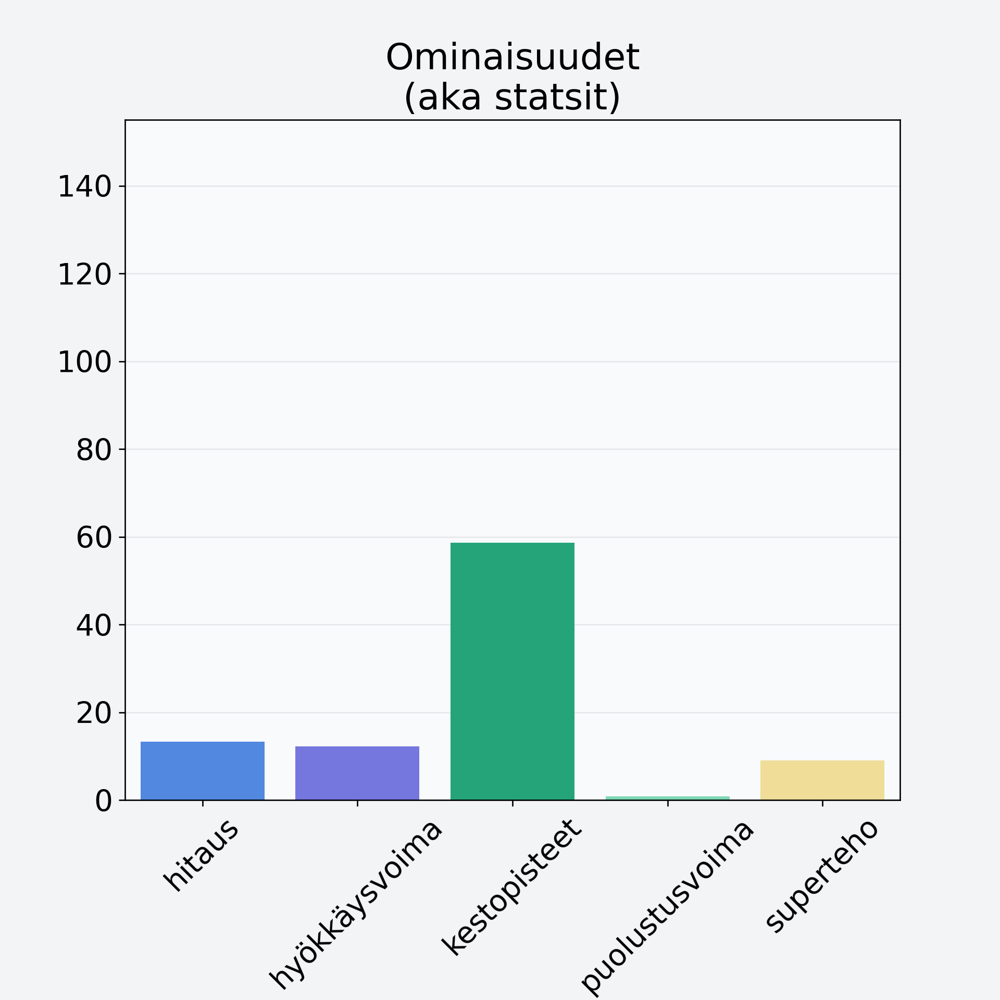

# Banaani, punnittu kuorineen

## Kilpailijan tiedot { data-search-exclude }

:octicons-shield-check-24:{ .shieldMarker } Kilpailija on Finelin hyväksymä.

{ loading=lazy }

## Lisätiedot { data-search-exclude }
=== "Statsit numeerisena"

     | Voima          |   Arvo |
     |:---------------|-------:|
     | hitaus         |  13.33 |
     | hyökkäysvoima  |  12.26 |
     | kestopisteet   |  58.68 |
     | puolustusvoima |   0.8  |
     | superteho      |   9.04 |

=== "Samankaltaisia kilpailijoita"
    [Papaija, kuivattu](/papaija-kuivattu){ .md-button .md-button--primary .similarProduct }
    [Meloni, verkkomeloni/cantaloupemeloni, kuorittu](/meloni-verkkomeloni-cantaloupemeloni-kuorittu){ .md-button .md-button--primary .similarProduct }
    [Papaija, kuorittu](/papaija-kuorittu){ .md-button .md-button--primary .similarProduct }
    [Banaani, punnittu kuorineen](/banaani-punnittu-kuorineen){ .md-button .md-button--primary .similarProduct }
    [Mango, kuivattu](/mango-kuivattu){ .md-button .md-button--primary .similarProduct }
    [Hunajameloni, punnittu kuorineen](/hunajameloni-punnittu-kuorineen){ .md-button .md-button--primary .similarProduct }

!!! info inline start "Huomio"

    Hyökkäysvoima vaihtelee eri sotureilla :)
