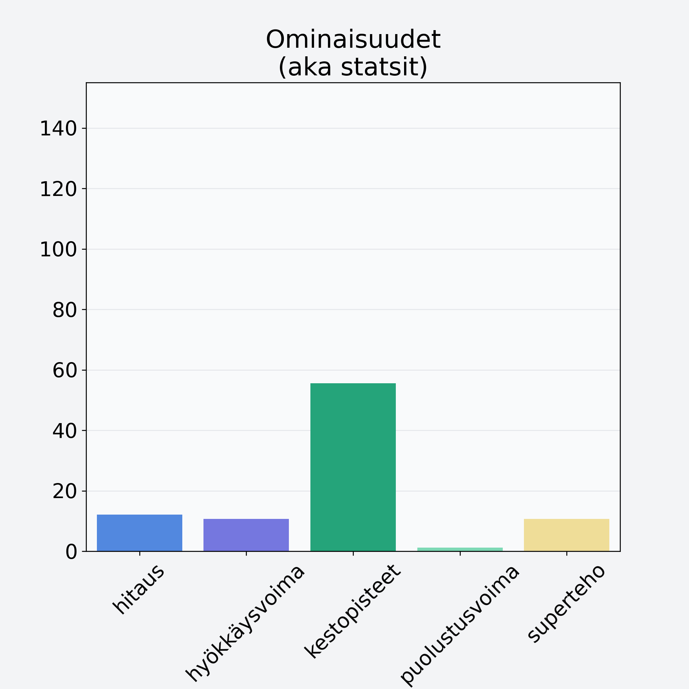

# Eksoottinen hedelmä, keskiarvo, mango/papaija, kuorittu

## Kilpailijan tiedot { data-search-exclude }

:octicons-shield-check-24:{ .shieldMarker } Kilpailija on Finelin hyväksymä.

{ loading=lazy }

## Lisätiedot { data-search-exclude }
=== "Statsit numeerisena"

     | Voima          |   Arvo |
     |:---------------|-------:|
     | hitaus         |  12.06 |
     | hyökkäysvoima  |  10.7  |
     | kestopisteet   |  55.62 |
     | puolustusvoima |   1.15 |
     | superteho      |  10.7  |

=== "Samankaltaisia kilpailijoita"
    [Ananas, kuorittu](/ananas-kuorittu){ .md-button .md-button--primary .similarProduct }
    [Eksoottinen hedelmä, keskiarvo, mango/papaija, kuorittu](/eksoottinen-hedelma-keskiarvo-mango-papaija-kuorittu){ .md-button .md-button--primary .similarProduct }
    [Hunajameloni, punnittu kuorineen](/hunajameloni-punnittu-kuorineen){ .md-button .md-button--primary .similarProduct }
    [Meloni, verkkomeloni/cantaloupemeloni, kuorittu](/meloni-verkkomeloni-cantaloupemeloni-kuorittu){ .md-button .md-button--primary .similarProduct }
    [Banaanilastu, kuivattu banaani](/banaanilastu-kuivattu-banaani){ .md-button .md-button--primary .similarProduct }

!!! info inline start "Huomio"

    Hyökkäysvoima vaihtelee eri sotureilla :)
