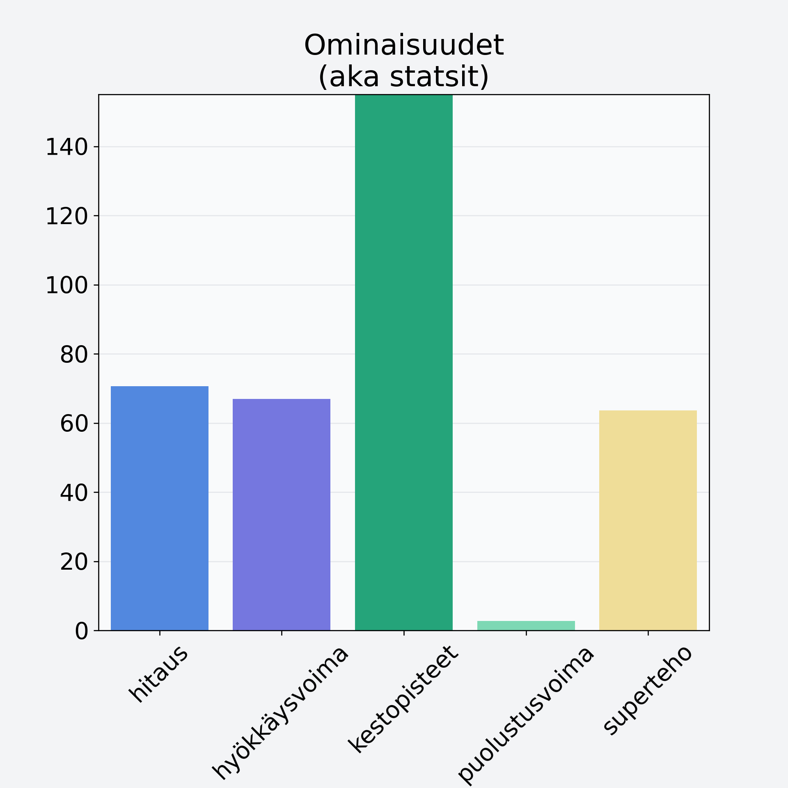

# Erikoishedelmä, eksoottinen, keskiarvo, mango/papaija, kuivattu

## Kilpailijan tiedot { data-search-exclude }

:octicons-shield-check-24:{ .shieldMarker } Kilpailija on Finelin hyväksymä.

{ loading=lazy }

## Lisätiedot { data-search-exclude }
=== "Statsit numeerisena"

     | Voima          |   Arvo |
     |:---------------|-------:|
     | hitaus         |  70.61 |
     | hyökkäysvoima  |  67    |
     | kestopisteet   | 302.33 |
     | puolustusvoima |   2.76 |
     | superteho      |  63.68 |

=== "Samankaltaisia kilpailijoita"
    [Ananas, tuore, punnittu kuorineen](/ananas-tuore-punnittu-kuorineen){ .md-button .md-button--primary .similarProduct }
    [Sharon, kaki, persimon](/sharon-kaki-persimon){ .md-button .md-button--primary .similarProduct }
    [Oliivi, keskiarvo, kivetön, öljyssä, vihreä/musta](/oliivi-keskiarvo-kiveton-oljyssa-vihrea-musta){ .md-button .md-button--primary .similarProduct }
    [Rusina](/rusina){ .md-button .md-button--primary .similarProduct }

!!! info inline start "Huomio"

    Hyökkäysvoima vaihtelee eri sotureilla :)
