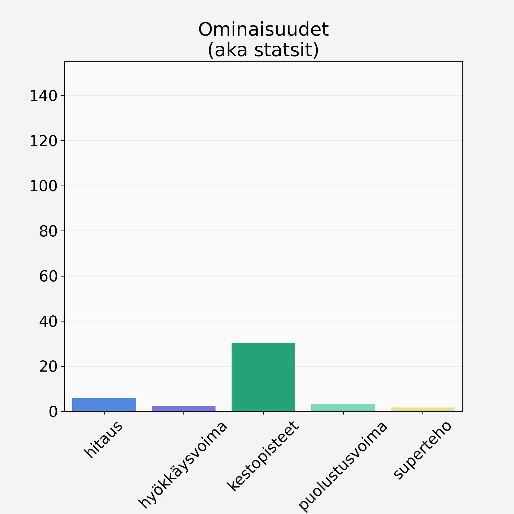

# Herkkutatti

## Kilpailijan tiedot { data-search-exclude }

:octicons-shield-check-24:{ .shieldMarker } Kilpailija on Finelin hyväksymä.

{ loading=lazy }

## Lisätiedot { data-search-exclude }
=== "Statsit numeerisena"

     | Voima          |   Arvo |
     |:---------------|-------:|
     | hitaus         |   5.75 |
     | hyökkäysvoima  |   2.37 |
     | kestopisteet   |  30.21 |
     | puolustusvoima |   3.15 |
     | superteho      |   1.61 |

=== "Samankaltaisia kilpailijoita"
    [Sieni, tatti, hapero](/sieni-tatti-hapero){ .md-button .md-button--primary .similarProduct }
    [Osterivinokas](/osterivinokas){ .md-button .md-button--primary .similarProduct }
    [Lampaankääpä](/lampaankaapa){ .md-button .md-button--primary .similarProduct }
    [Mustatorvisieni, kuivattu](/mustatorvisieni-kuivattu){ .md-button .md-button--primary .similarProduct }
    [Korvasieni](/korvasieni){ .md-button .md-button--primary .similarProduct }
    [Karvarousku](/karvarousku){ .md-button .md-button--primary .similarProduct }

!!! info inline start "Huomio"

    Hyökkäysvoima vaihtelee eri sotureilla :)
