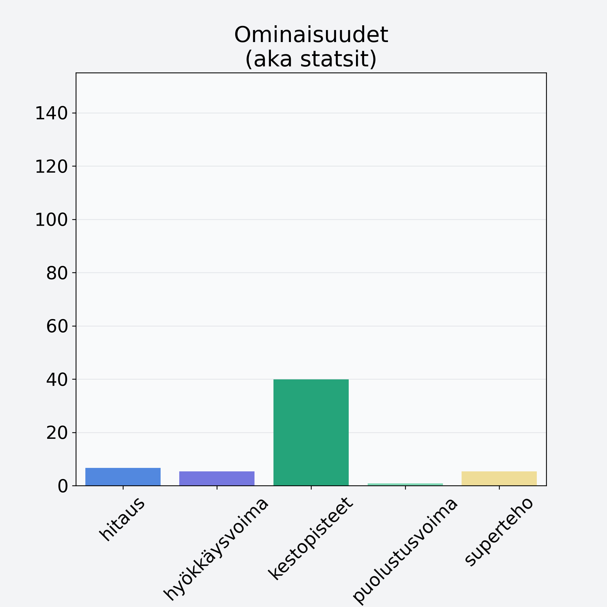

# Karviainen

## Kilpailijan tiedot { data-search-exclude }

:octicons-shield-check-24:{ .shieldMarker } Kilpailija on Finelin hyväksymä.

{ loading=lazy }

## Lisätiedot { data-search-exclude }
=== "Statsit numeerisena"

     | Voima          |   Arvo |
     |:---------------|-------:|
     | hitaus         |   6.68 |
     | hyökkäysvoima  |   5.4  |
     | kestopisteet   |  39.89 |
     | puolustusvoima |   0.88 |
     | superteho      |   5.4  |

=== "Samankaltaisia kilpailijoita"
    [Tyrnimarja](/tyrnimarja){ .md-button .md-button--primary .similarProduct }
    [Puolukka](/puolukka){ .md-button .md-button--primary .similarProduct }
    [Mansikka](/mansikka){ .md-button .md-button--primary .similarProduct }
    [Vadelma](/vadelma){ .md-button .md-button--primary .similarProduct }

!!! info inline start "Huomio"

    Hyökkäysvoima vaihtelee eri sotureilla :)
