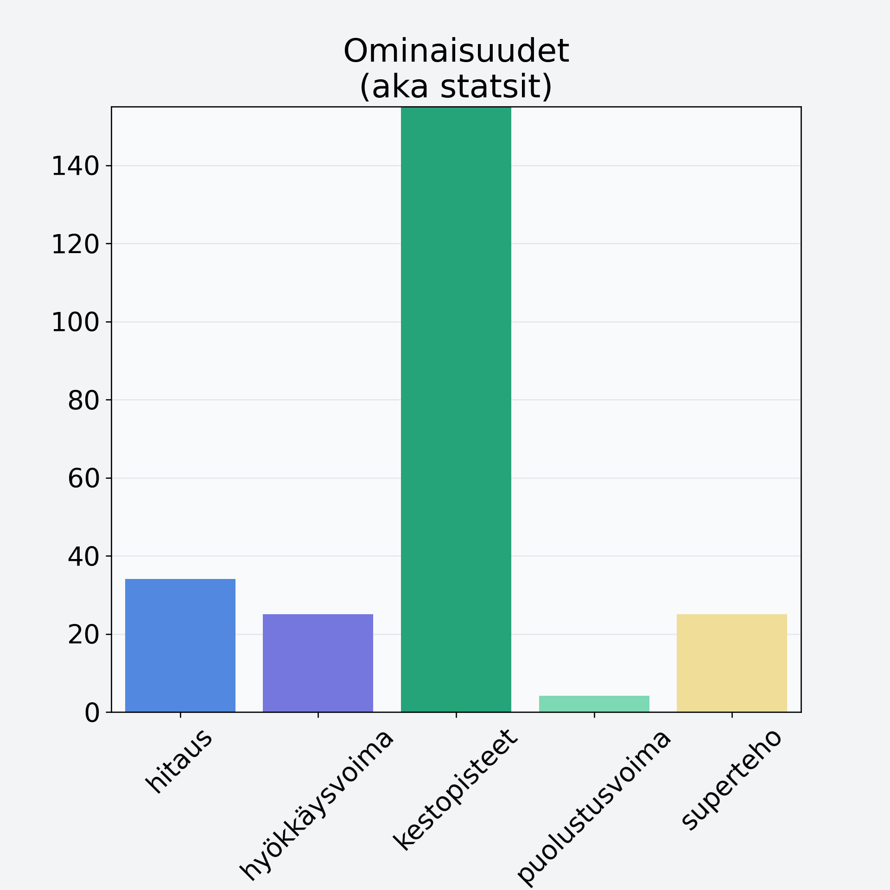

# Katajanmarja

## Kilpailijan tiedot { data-search-exclude }

:octicons-shield-check-24:{ .shieldMarker } Kilpailija on Finelin hyväksymä.

{ loading=lazy }

## Lisätiedot { data-search-exclude }
=== "Statsit numeerisena"

     | Voima          |   Arvo |
     |:---------------|-------:|
     | hitaus         |  34.1  |
     | hyökkäysvoima  |  25    |
     | kestopisteet   | 248.02 |
     | puolustusvoima |   4.2  |
     | superteho      |  25    |

=== "Samankaltaisia kilpailijoita"
    [Puolukka, kuivattu, puolukkajauhe](/puolukka-kuivattu-puolukkajauhe){ .md-button .md-button--primary .similarProduct }
    [Mustikka, kuivattu, mustikkajauhe](/mustikka-kuivattu-mustikkajauhe){ .md-button .md-button--primary .similarProduct }
    [Lakka, suomuurain, hilla](/lakka-suomuurain-hilla){ .md-button .md-button--primary .similarProduct }
    [Pihlajanmarja](/pihlajanmarja){ .md-button .md-button--primary .similarProduct }
    [Marja-aronia, kuivattu, marja-aroniajauhe](/marja-aronia-kuivattu-marja-aroniajauhe){ .md-button .md-button--primary .similarProduct }

!!! info inline start "Huomio"

    Hyökkäysvoima vaihtelee eri sotureilla :)
