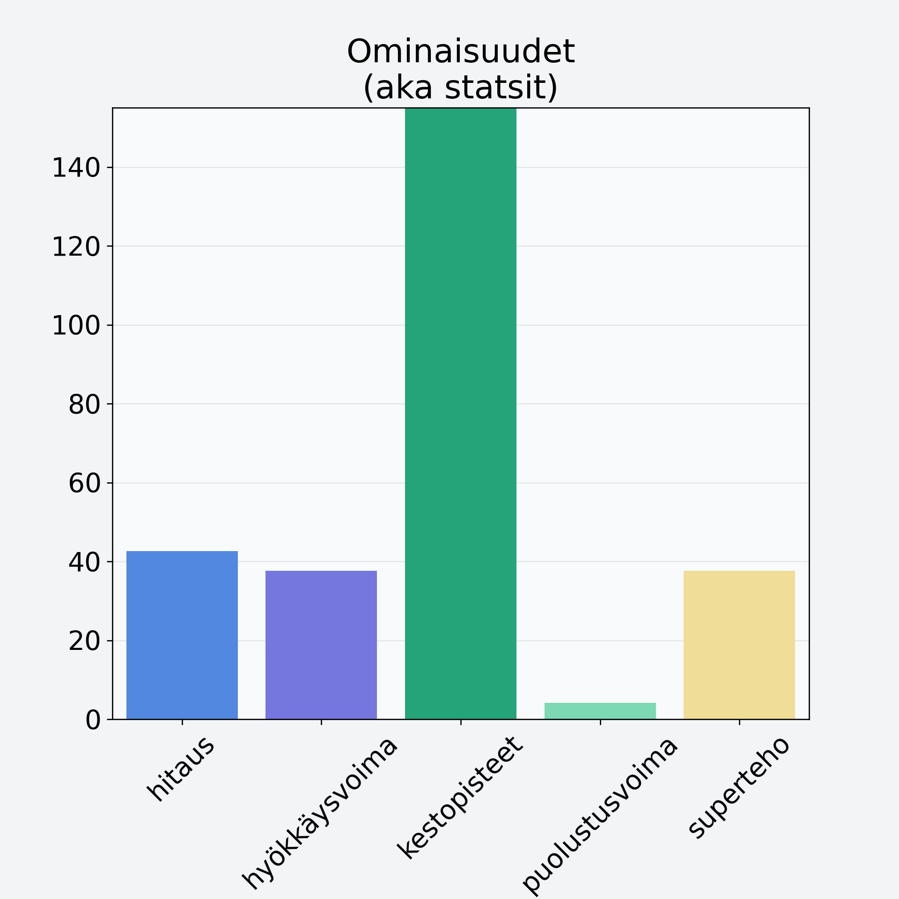

# Luumu, kivetön, kuivattu

## Kilpailijan tiedot { data-search-exclude }

:octicons-shield-check-24:{ .shieldMarker } Kilpailija on Finelin hyväksymä.

{ loading=lazy }

## Lisätiedot { data-search-exclude }
=== "Statsit numeerisena"

     | Voima          |   Arvo |
     |:---------------|-------:|
     | hitaus         |  42.64 |
     | hyökkäysvoima  |  37.6  |
     | kestopisteet   | 203.51 |
     | puolustusvoima |   4.19 |
     | superteho      |  37.6  |

=== "Samankaltaisia kilpailijoita"
    [Luumu, kivetön, kuivattu](/luumu-kiveton-kuivattu){ .md-button .md-button--primary .similarProduct }
    [Aprikoosi, keskiarvo, punnittu kivineen](/aprikoosi-keskiarvo-punnittu-kivineen){ .md-button .md-button--primary .similarProduct }
    [Omena, kotimainen, kuorineen](/omena-kotimainen-kuorineen){ .md-button .md-button--primary .similarProduct }
    [Omena, keskiarvo, punnittu kuorineen](/omena-keskiarvo-punnittu-kuorineen){ .md-button .md-button--primary .similarProduct }
    [Aprikoosi, keskiarvo, kivetön](/aprikoosi-keskiarvo-kiveton){ .md-button .md-button--primary .similarProduct }
    [Luumu, tumma, punnittu kivineen](/luumu-tumma-punnittu-kivineen){ .md-button .md-button--primary .similarProduct }

!!! info inline start "Huomio"

    Hyökkäysvoima vaihtelee eri sotureilla :)
