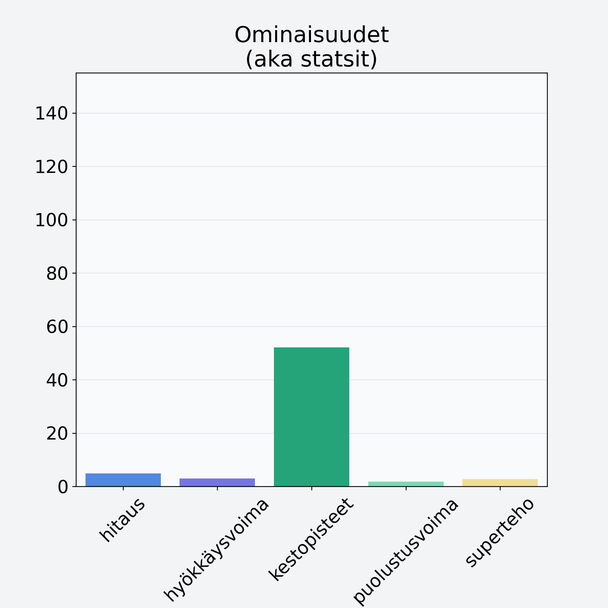

# Maa-artisokka

## Kilpailijan tiedot { data-search-exclude }

:octicons-shield-check-24:{ .shieldMarker } Kilpailija on Finelin hyväksymä.

{ loading=lazy }

## Lisätiedot { data-search-exclude }
=== "Statsit numeerisena"

     | Voima          |   Arvo |
     |:---------------|-------:|
     | hitaus         |   4.81 |
     | hyökkäysvoima  |   2.91 |
     | kestopisteet   |  52.16 |
     | puolustusvoima |   1.8  |
     | superteho      |   2.76 |

=== "Samankaltaisia kilpailijoita"
    [Retiisi](/retiisi){ .md-button .md-button--primary .similarProduct }
    [Porkkana](/porkkana){ .md-button .md-button--primary .similarProduct }
    [Vesikastanja](/vesikastanja){ .md-button .md-button--primary .similarProduct }
    [Inkivääri, juurakko, raaka](/inkivaari-juurakko-raaka){ .md-button .md-button--primary .similarProduct }

!!! info inline start "Huomio"

    Hyökkäysvoima vaihtelee eri sotureilla :)
