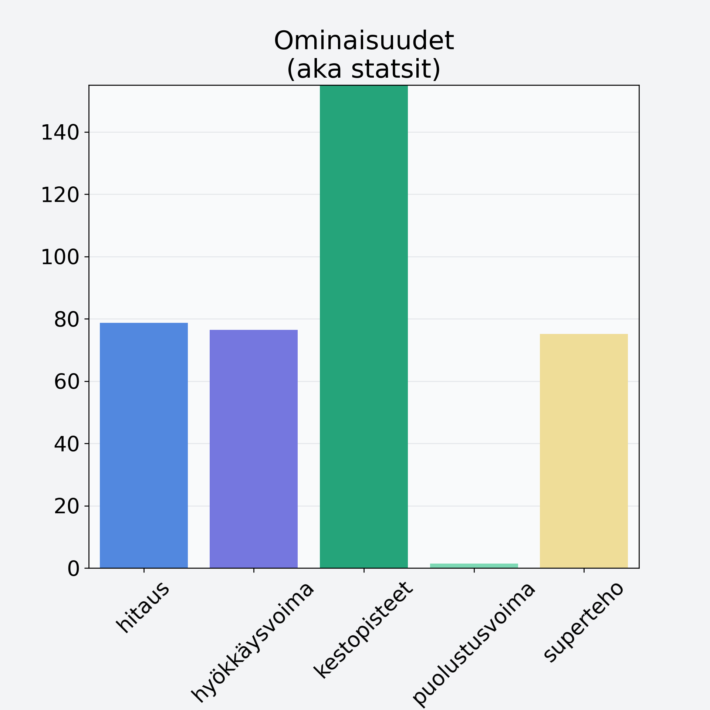

# Mango, kuivattu

## Kilpailijan tiedot { data-search-exclude }

:octicons-shield-check-24:{ .shieldMarker } Kilpailija on Finelin hyväksymä.

{ loading=lazy }

## Lisätiedot { data-search-exclude }
=== "Statsit numeerisena"

     | Voima          |   Arvo |
     |:---------------|-------:|
     | hitaus         |  78.67 |
     | hyökkäysvoima  |  76.41 |
     | kestopisteet   | 334.87 |
     | puolustusvoima |   1.48 |
     | superteho      |  75.16 |

=== "Samankaltaisia kilpailijoita"
    [Kiivi, kuorittu](/kiivi-kuorittu){ .md-button .md-button--primary .similarProduct }
    [Banaanilastu, kuivattu banaani, jogurttikuorrutus](/banaanilastu-kuivattu-banaani-jogurttikuorrutus){ .md-button .md-button--primary .similarProduct }
    [Välipalapatukka, raakapatukka, bare bar, viljaton](/valipalapatukka-raakapatukka-bare-bar-viljaton){ .md-button .md-button--primary .similarProduct }

!!! info inline start "Huomio"

    Hyökkäysvoima vaihtelee eri sotureilla :)
