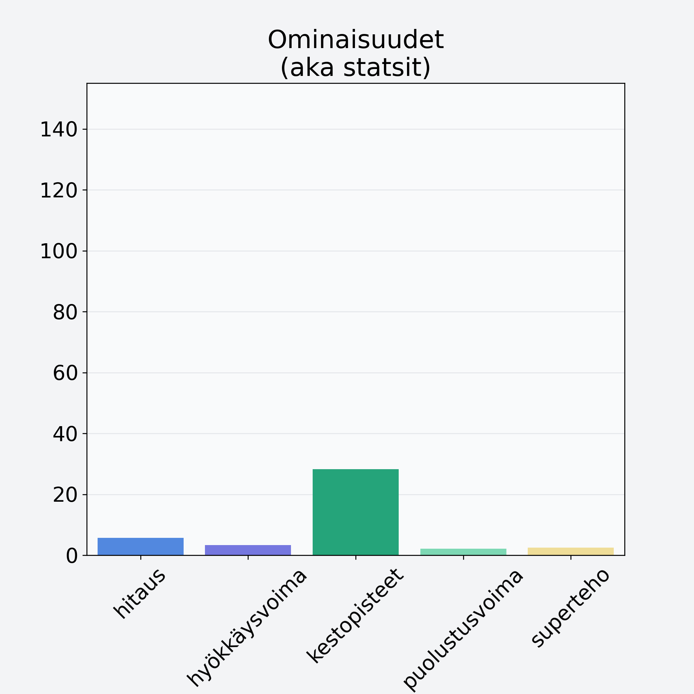

# Männynherkkutatti, pakaste

## Kilpailijan tiedot { data-search-exclude }

:octicons-shield-check-24:{ .shieldMarker } Kilpailija on Finelin hyväksymä.

{ loading=lazy }

## Lisätiedot { data-search-exclude }
=== "Statsit numeerisena"

     | Voima          |   Arvo |
     |:---------------|-------:|
     | hitaus         |   5.67 |
     | hyökkäysvoima  |   3.27 |
     | kestopisteet   |  28.28 |
     | puolustusvoima |   2.1  |
     | superteho      |   2.5  |

=== "Samankaltaisia kilpailijoita"
    [Punikkitatti](/punikkitatti){ .md-button .md-button--primary .similarProduct }
    [Kangasrousku](/kangasrousku){ .md-button .md-button--primary .similarProduct }
    [Karvarousku](/karvarousku){ .md-button .md-button--primary .similarProduct }

!!! info inline start "Huomio"

    Hyökkäysvoima vaihtelee eri sotureilla :)
