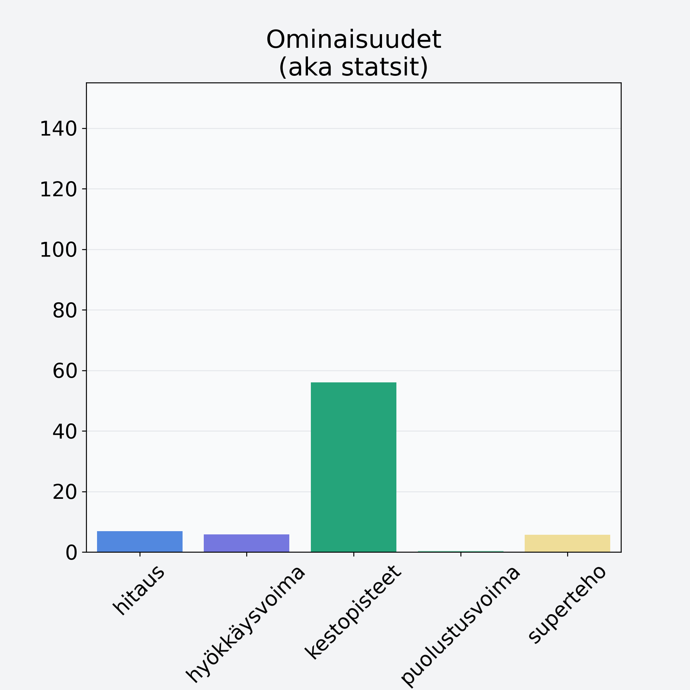

# Marja-aronia

## Kilpailijan tiedot { data-search-exclude }

:octicons-shield-check-24:{ .shieldMarker } Kilpailija on Finelin hyväksymä.

{ loading=lazy }

## Lisätiedot { data-search-exclude }
=== "Statsit numeerisena"

     | Voima          |   Arvo |
     |:---------------|-------:|
     | hitaus         |   6.88 |
     | hyökkäysvoima  |   5.85 |
     | kestopisteet   |  56.08 |
     | puolustusvoima |   0.4  |
     | superteho      |   5.7  |

=== "Samankaltaisia kilpailijoita"
    [Sorbetti, vadelmasorbetti, teollinen](/sorbetti-vadelmasorbetti-teollinen){ .md-button .md-button--primary .similarProduct }
    [Marja-aronia, kuivattu, marja-aroniajauhe](/marja-aronia-kuivattu-marja-aroniajauhe){ .md-button .md-button--primary .similarProduct }
    [Mustikka, pensasmustikka](/mustikka-pensasmustikka){ .md-button .md-button--primary .similarProduct }
    [Punaherukka](/punaherukka){ .md-button .md-button--primary .similarProduct }
    [Ruusunmarja, kuivattu, ruusunmarjajauhe](/ruusunmarja-kuivattu-ruusunmarjajauhe){ .md-button .md-button--primary .similarProduct }

!!! info inline start "Huomio"

    Hyökkäysvoima vaihtelee eri sotureilla :)
