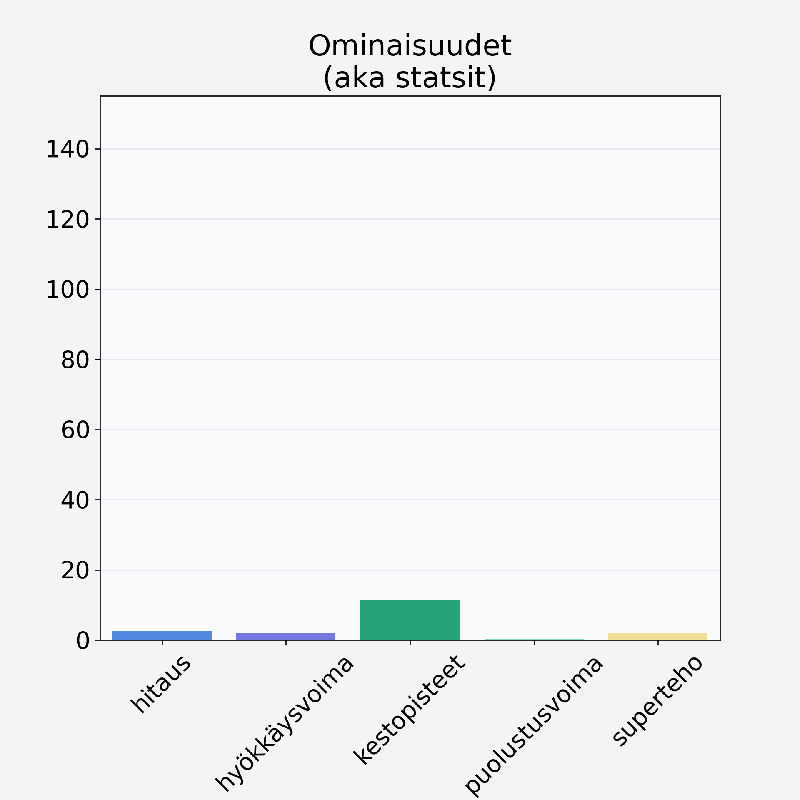

# Meloni, verkko/cantaloupemeloni, punnittu kuorineen

## Kilpailijan tiedot { data-search-exclude }

:octicons-shield-check-24:{ .shieldMarker } Kilpailija on Finelin hyväksymä.

{ loading=lazy }

## Lisätiedot { data-search-exclude }
=== "Statsit numeerisena"

     | Voima          |   Arvo |
     |:---------------|-------:|
     | hitaus         |   2.46 |
     | hyökkäysvoima  |   2.05 |
     | kestopisteet   |  11.31 |
     | puolustusvoima |   0.31 |
     | superteho      |   2.05 |

=== "Samankaltaisia kilpailijoita"
    [Oliivi, keskiarvo, kivetön, suolaliemessä, vihreä](/oliivi-keskiarvo-kiveton-suolaliemessa-vihrea){ .md-button .md-button--primary .similarProduct }
    [Avokado, punnittu kuorineen ja kivineen](/avokado-punnittu-kuorineen-ja-kivineen){ .md-button .md-button--primary .similarProduct }
    [Oliivi, keskiarvo, punnittu kivineen, öljyssä, vihreä/musta](/oliivi-keskiarvo-punnittu-kivineen-oljyssa-vihrea-musta){ .md-button .md-button--primary .similarProduct }
    [Oliivi, keskiarvo, kivetön, öljyssä, vihreä/musta](/oliivi-keskiarvo-kiveton-oljyssa-vihrea-musta){ .md-button .md-button--primary .similarProduct }
    [Ananas, kuivattu](/ananas-kuivattu){ .md-button .md-button--primary .similarProduct }
    [Hunajameloni, punnittu kuorineen](/hunajameloni-punnittu-kuorineen){ .md-button .md-button--primary .similarProduct }

!!! info inline start "Huomio"

    Hyökkäysvoima vaihtelee eri sotureilla :)
