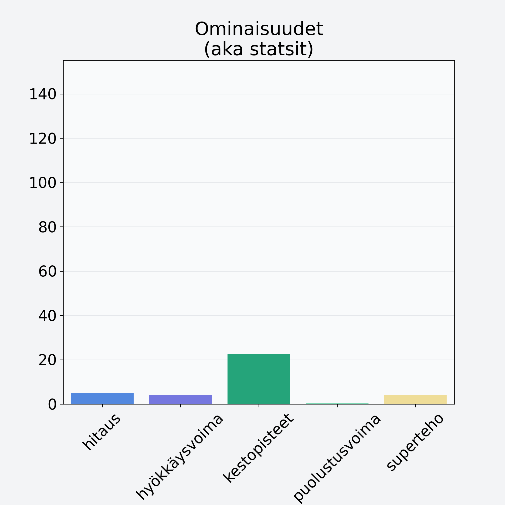

# Meloni, verkkomeloni/cantaloupemeloni, kuorittu

## Kilpailijan tiedot { data-search-exclude }

:octicons-shield-check-24:{ .shieldMarker } Kilpailija on Finelin hyväksymä.

{ loading=lazy }

## Lisätiedot { data-search-exclude }
=== "Statsit numeerisena"

     | Voima          |   Arvo |
     |:---------------|-------:|
     | hitaus         |   4.92 |
     | hyökkäysvoima  |   4.1  |
     | kestopisteet   |  22.62 |
     | puolustusvoima |   0.63 |
     | superteho      |   4.1  |

=== "Samankaltaisia kilpailijoita"
    [Sharon, kaki, persimon](/sharon-kaki-persimon){ .md-button .md-button--primary .similarProduct }
    [Ananas, kuivattu, jogurttikuorrutus](/ananas-kuivattu-jogurttikuorrutus){ .md-button .md-button--primary .similarProduct }
    [Hunajameloni, punnittu kuorineen](/hunajameloni-punnittu-kuorineen){ .md-button .md-button--primary .similarProduct }

!!! info inline start "Huomio"

    Hyökkäysvoima vaihtelee eri sotureilla :)
