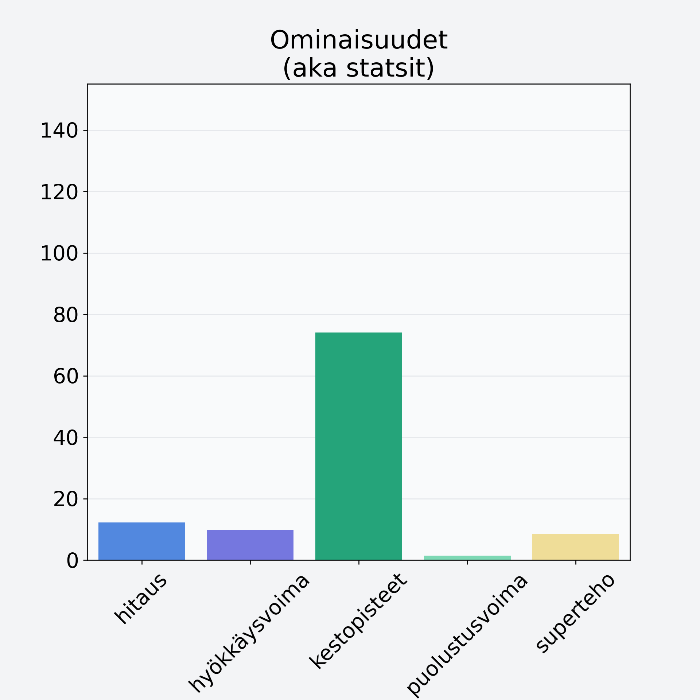

# Mustaherukka

## Kilpailijan tiedot { data-search-exclude }

:octicons-shield-check-24:{ .shieldMarker } Kilpailija on Finelin hyväksymä.

{ loading=lazy }

## Lisätiedot { data-search-exclude }
=== "Statsit numeerisena"

     | Voima          |   Arvo |
     |:---------------|-------:|
     | hitaus         |  12.19 |
     | hyökkäysvoima  |   9.72 |
     | kestopisteet   |  74.12 |
     | puolustusvoima |   1.38 |
     | superteho      |   8.57 |

=== "Samankaltaisia kilpailijoita"
    [Marja-aronia, kuivattu, marja-aroniajauhe](/marja-aronia-kuivattu-marja-aroniajauhe){ .md-button .md-button--primary .similarProduct }
    [Ruusunmarja, kuivattu, ruusunmarjajauhe](/ruusunmarja-kuivattu-ruusunmarjajauhe){ .md-button .md-button--primary .similarProduct }
    [Pihlajanmarja](/pihlajanmarja){ .md-button .md-button--primary .similarProduct }
    [Puolukka](/puolukka){ .md-button .md-button--primary .similarProduct }

!!! info inline start "Huomio"

    Hyökkäysvoima vaihtelee eri sotureilla :)
