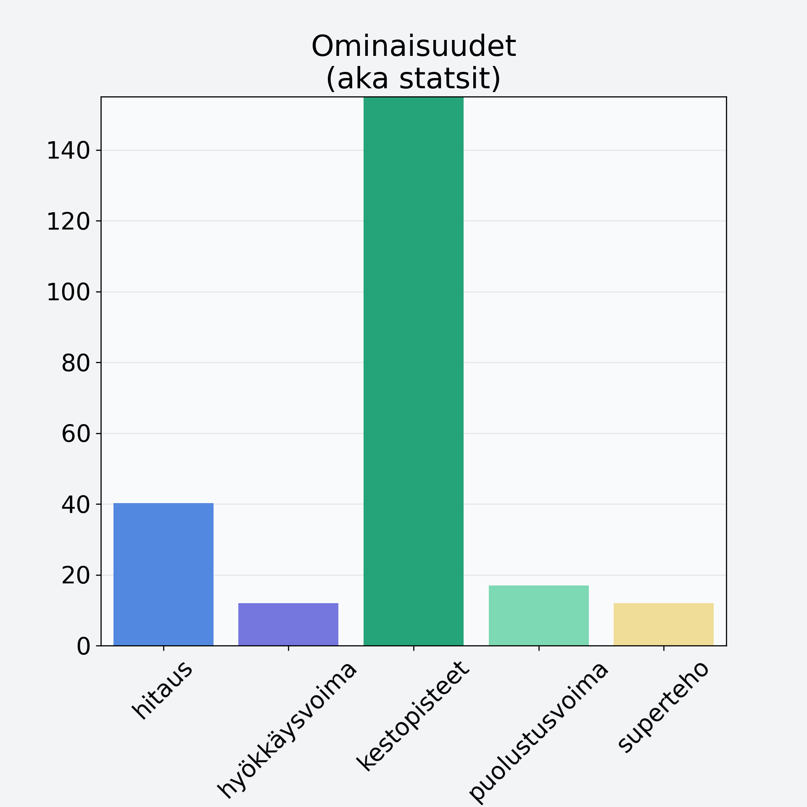

# Mustatorvisieni, kuivattu

## Kilpailijan tiedot { data-search-exclude }

:octicons-shield-check-24:{ .shieldMarker } Kilpailija on Finelin hyväksymä.

{ loading=lazy }

## Lisätiedot { data-search-exclude }
=== "Statsit numeerisena"

     | Voima          |   Arvo |
     |:---------------|-------:|
     | hitaus         |  40.2  |
     | hyökkäysvoima  |  12    |
     | kestopisteet   | 289.53 |
     | puolustusvoima |  17    |
     | superteho      |  12    |

=== "Samankaltaisia kilpailijoita"
    [Suppilovahvero](/suppilovahvero){ .md-button .md-button--primary .similarProduct }
    [Korvasieni](/korvasieni){ .md-button .md-button--primary .similarProduct }
    [Sieni, tatti, hapero](/sieni-tatti-hapero){ .md-button .md-button--primary .similarProduct }
    [Kangastatti](/kangastatti){ .md-button .md-button--primary .similarProduct }

!!! info inline start "Huomio"

    Hyökkäysvoima vaihtelee eri sotureilla :)
