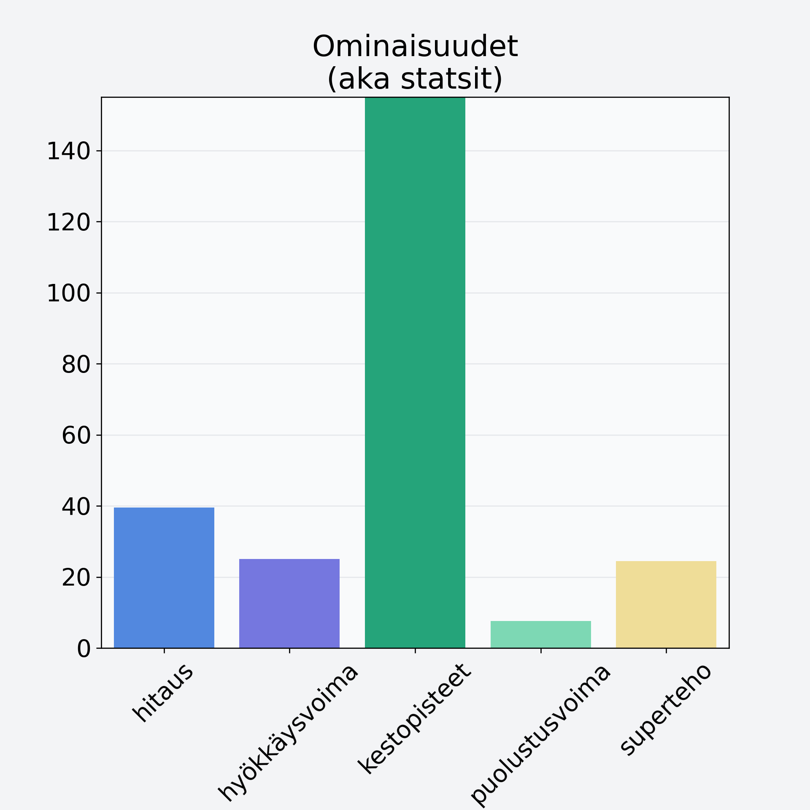

# Mustikka, kuivattu, mustikkajauhe

## Kilpailijan tiedot { data-search-exclude }

:octicons-shield-check-24:{ .shieldMarker } Kilpailija on Finelin hyväksymä.

{ loading=lazy }

## Lisätiedot { data-search-exclude }
=== "Statsit numeerisena"

     | Voima          |   Arvo |
     |:---------------|-------:|
     | hitaus         |  39.59 |
     | hyökkäysvoima  |  25.09 |
     | kestopisteet   | 302.89 |
     | puolustusvoima |   7.6  |
     | superteho      |  24.49 |

=== "Samankaltaisia kilpailijoita"
    [Tyrnimarja](/tyrnimarja){ .md-button .md-button--primary .similarProduct }
    [Marja-aronia, kuivattu, marja-aroniajauhe](/marja-aronia-kuivattu-marja-aroniajauhe){ .md-button .md-button--primary .similarProduct }
    [Mustikka, pensasmustikka](/mustikka-pensasmustikka){ .md-button .md-button--primary .similarProduct }
    [Lakka, suomuurain, hilla](/lakka-suomuurain-hilla){ .md-button .md-button--primary .similarProduct }
    [Tyrnimarja, kuivattu, tyrnimarjajauhe](/tyrnimarja-kuivattu-tyrnimarjajauhe){ .md-button .md-button--primary .similarProduct }
    [Sorbetti, vadelmasorbetti, teollinen](/sorbetti-vadelmasorbetti-teollinen){ .md-button .md-button--primary .similarProduct }

!!! info inline start "Huomio"

    Hyökkäysvoima vaihtelee eri sotureilla :)
