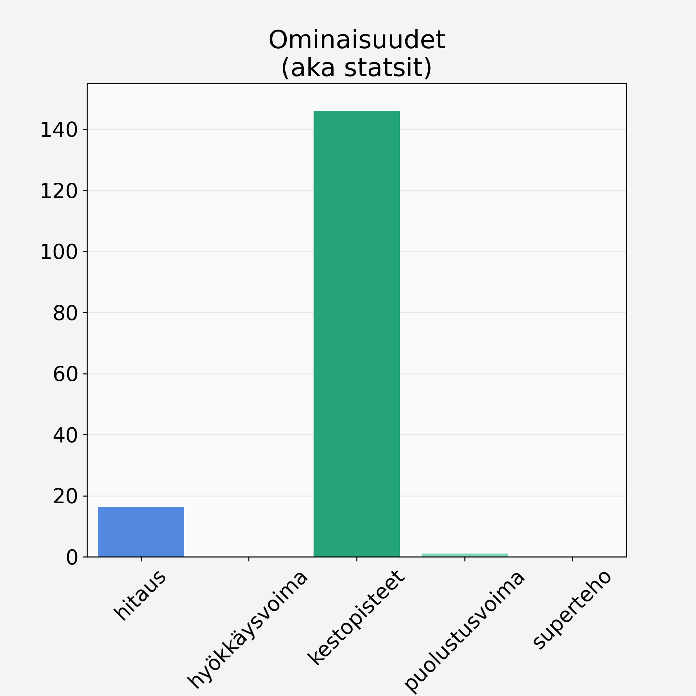

# Oliivi, keskiarvo, kivetön, suolaliemessä, vihreä

## Kilpailijan tiedot { data-search-exclude }

:octicons-shield-check-24:{ .shieldMarker } Kilpailija on Finelin hyväksymä.

{ loading=lazy }

## Lisätiedot { data-search-exclude }
=== "Statsit numeerisena"

     | Voima          |   Arvo |
     |:---------------|-------:|
     | hitaus         |  16.35 |
     | hyökkäysvoima  |   0    |
     | kestopisteet   | 145.97 |
     | puolustusvoima |   1.03 |
     | superteho      |   0    |

=== "Samankaltaisia kilpailijoita"
    [Avokado, kuorittu, kivetön](/avokado-kuorittu-kiveton){ .md-button .md-button--primary .similarProduct }
    [Viinirypäle, keskiarvo, punnittu kivineen, vihreä/tumma](/viinirypale-keskiarvo-punnittu-kivineen-vihrea-tumma){ .md-button .md-button--primary .similarProduct }
    [Hunajameloni, kuorittu](/hunajameloni-kuorittu){ .md-button .md-button--primary .similarProduct }
    [Hunajameloni, punnittu kuorineen](/hunajameloni-punnittu-kuorineen){ .md-button .md-button--primary .similarProduct }
    [Viikuna, kuivattu, punnittu kantoineen](/viikuna-kuivattu-punnittu-kantoineen){ .md-button .md-button--primary .similarProduct }
    [Avokado, punnittu kuorineen ja kivineen](/avokado-punnittu-kuorineen-ja-kivineen){ .md-button .md-button--primary .similarProduct }

!!! info inline start "Huomio"

    Hyökkäysvoima vaihtelee eri sotureilla :)
