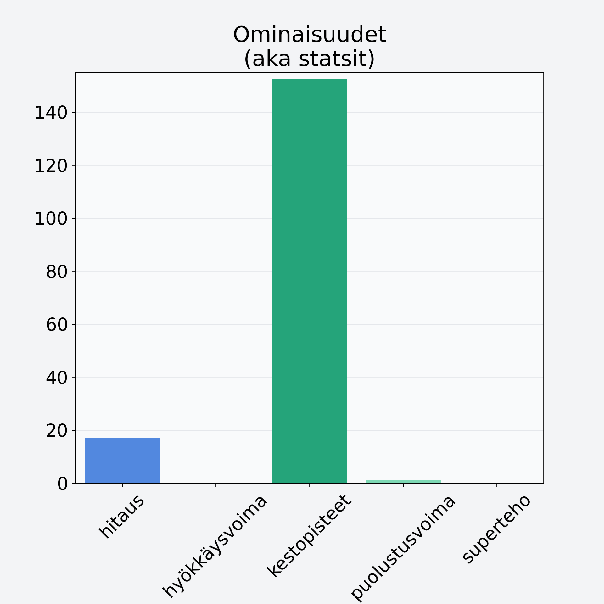

# Oliivi, keskiarvo, punnittu kivineen, öljyssä, vihreä/musta

## Kilpailijan tiedot { data-search-exclude }

:octicons-shield-check-24:{ .shieldMarker } Kilpailija on Finelin hyväksymä.

{ loading=lazy }

## Lisätiedot { data-search-exclude }
=== "Statsit numeerisena"

     | Voima          |   Arvo |
     |:---------------|-------:|
     | hitaus         |  17.1  |
     | hyökkäysvoima  |   0    |
     | kestopisteet   | 152.69 |
     | puolustusvoima |   1.1  |
     | superteho      |   0    |

=== "Samankaltaisia kilpailijoita"
    [Viinirypäle, keskiarvo, kivetön, vihreä/tumma](/viinirypale-keskiarvo-kiveton-vihrea-tumma){ .md-button .md-button--primary .similarProduct }
    [Jogurttirusina/jogurttihedelmä, kuorrutettu kuivattu hedelmä](/jogurttirusina-jogurttihedelma-kuorrutettu-kuivattu-hedelma){ .md-button .md-button--primary .similarProduct }
    [Viikuna, kuivattu, punnittu kantoineen](/viikuna-kuivattu-punnittu-kantoineen){ .md-button .md-button--primary .similarProduct }

!!! info inline start "Huomio"

    Hyökkäysvoima vaihtelee eri sotureilla :)
