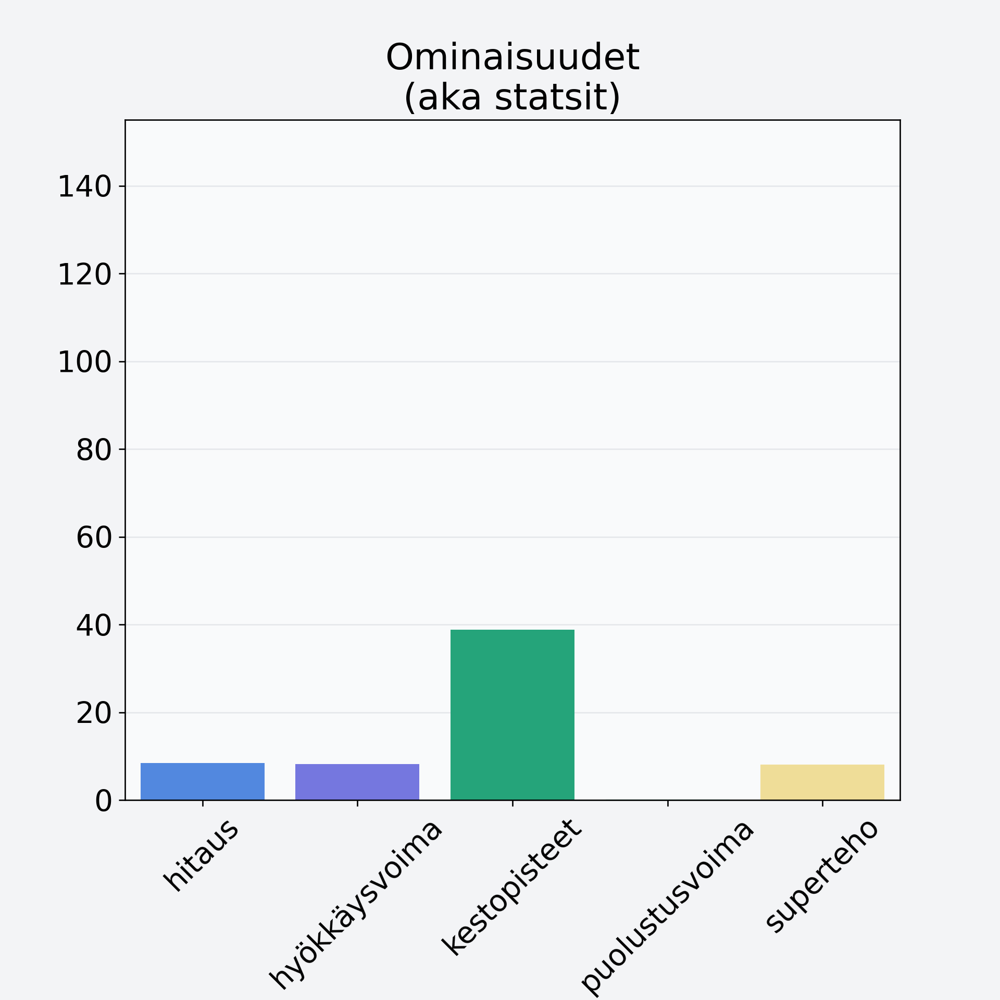

# Omena, ulkomainen, kuorineen

## Kilpailijan tiedot { data-search-exclude }

:octicons-shield-check-24:{ .shieldMarker } Kilpailija on Finelin hyväksymä.

{ loading=lazy }

## Lisätiedot { data-search-exclude }
=== "Statsit numeerisena"

     | Voima          |   Arvo |
     |:---------------|-------:|
     | hitaus         |   8.46 |
     | hyökkäysvoima  |   8.2  |
     | kestopisteet   |  38.87 |
     | puolustusvoima |   0.17 |
     | superteho      |   8.11 |

=== "Samankaltaisia kilpailijoita"
    [Päärynä, kuorittu](/paaryna-kuorittu){ .md-button .md-button--primary .similarProduct }
    [Aprikoosi, kuivattu](/aprikoosi-kuivattu){ .md-button .md-button--primary .similarProduct }
    [Persikka, kuivattu](/persikka-kuivattu){ .md-button .md-button--primary .similarProduct }
    [Luumu, kivetön](/luumu-kiveton){ .md-button .md-button--primary .similarProduct }
    [Aprikoosi, keskiarvo, punnittu kivineen](/aprikoosi-keskiarvo-punnittu-kivineen){ .md-button .md-button--primary .similarProduct }
    [Omenalastu](/omenalastu){ .md-button .md-button--primary .similarProduct }

!!! info inline start "Huomio"

    Hyökkäysvoima vaihtelee eri sotureilla :)
