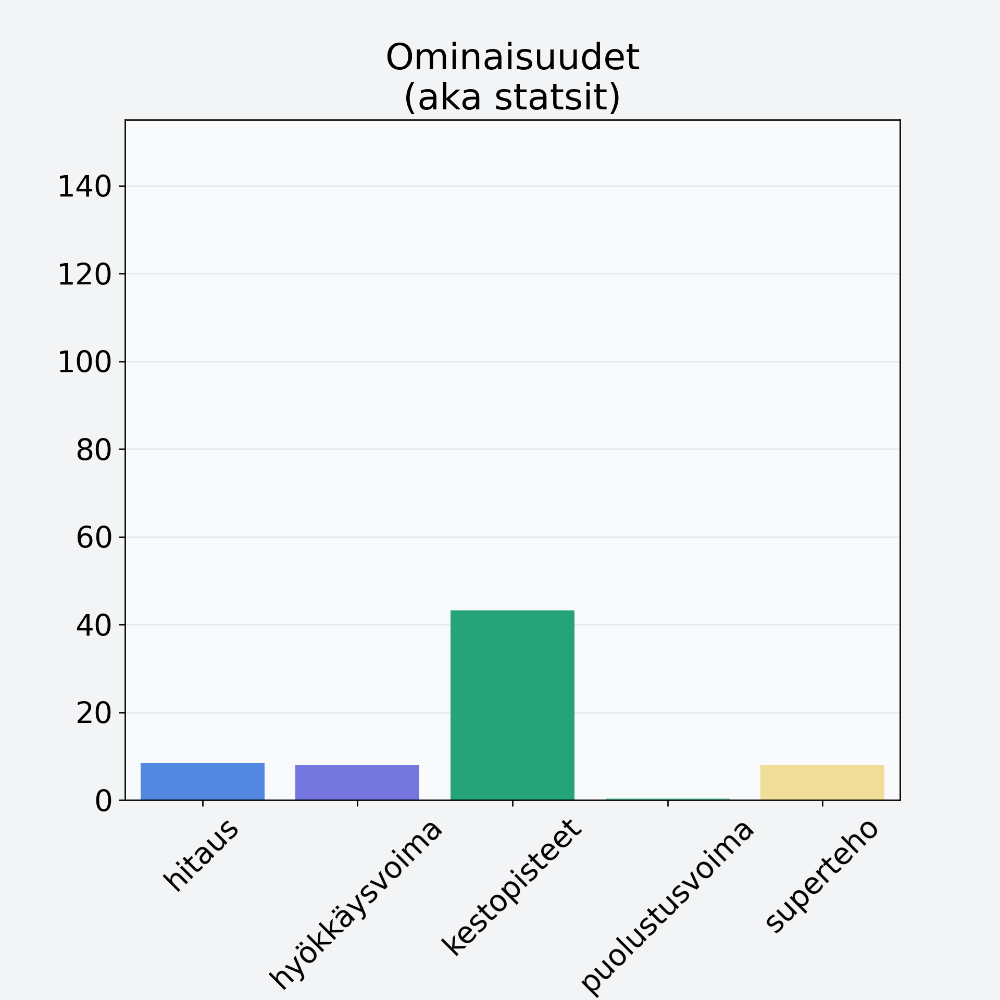

# Päärynä, kuorittu

## Kilpailijan tiedot { data-search-exclude }

:octicons-shield-check-24:{ .shieldMarker } Kilpailija on Finelin hyväksymä.

{ loading=lazy }

## Lisätiedot { data-search-exclude }
=== "Statsit numeerisena"

     | Voima          |   Arvo |
     |:---------------|-------:|
     | hitaus         |   8.4  |
     | hyökkäysvoima  |   8    |
     | kestopisteet   |  43.24 |
     | puolustusvoima |   0.31 |
     | superteho      |   8    |

=== "Samankaltaisia kilpailijoita"
    [Päärynä, punnittu kuorineen](/paaryna-punnittu-kuorineen){ .md-button .md-button--primary .similarProduct }
    [Luumu, tumma, punnittu kivineen](/luumu-tumma-punnittu-kivineen){ .md-button .md-button--primary .similarProduct }
    [Omenalastu](/omenalastu){ .md-button .md-button--primary .similarProduct }
    [Päärynä, kuorittu](/paaryna-kuorittu){ .md-button .md-button--primary .similarProduct }

!!! info inline start "Huomio"

    Hyökkäysvoima vaihtelee eri sotureilla :)
