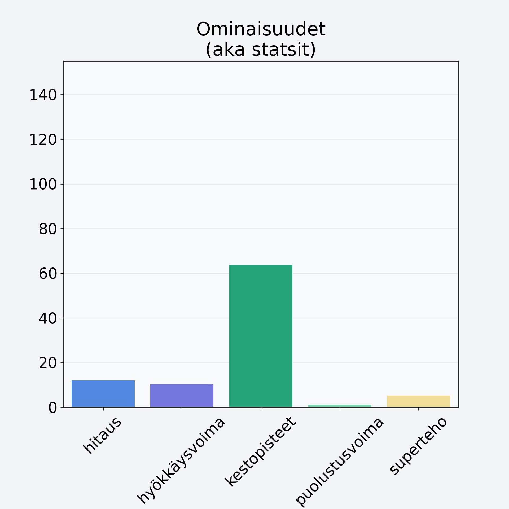

# Palsternakka

## Kilpailijan tiedot { data-search-exclude }

:octicons-shield-check-24:{ .shieldMarker } Kilpailija on Finelin hyväksymä.

{ loading=lazy }

## Lisätiedot { data-search-exclude }
=== "Statsit numeerisena"

     | Voima          |   Arvo |
     |:---------------|-------:|
     | hitaus         |  11.98 |
     | hyökkäysvoima  |  10.31 |
     | kestopisteet   |  63.79 |
     | puolustusvoima |   1.1  |
     | superteho      |   5.21 |

=== "Samankaltaisia kilpailijoita"
    [Punajuuri](/punajuuri){ .md-button .md-button--primary .similarProduct }
    [Sekavihannes, porkkana, kukkakaali, herne, papu](/sekavihannes-porkkana-kukkakaali-herne-papu){ .md-button .md-button--primary .similarProduct }
    [Lanttu](/lanttu){ .md-button .md-button--primary .similarProduct }
    [Porkkana](/porkkana){ .md-button .md-button--primary .similarProduct }
    [Nauris](/nauris){ .md-button .md-button--primary .similarProduct }

!!! info inline start "Huomio"

    Hyökkäysvoima vaihtelee eri sotureilla :)
