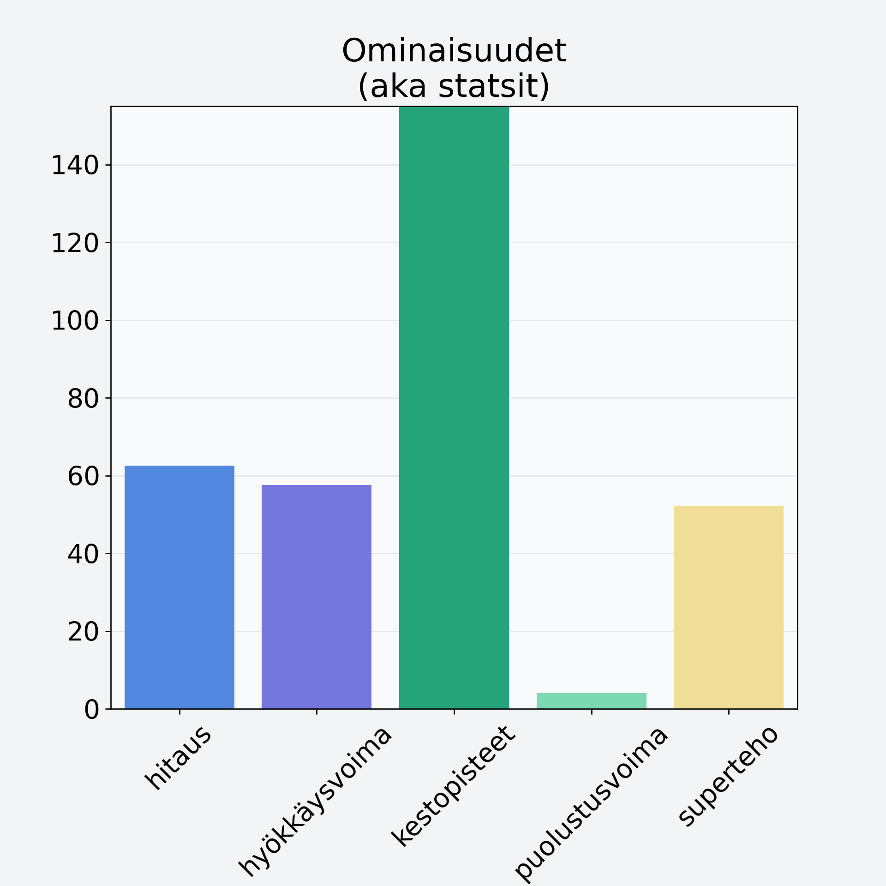

# Papaija, kuivattu

## Kilpailijan tiedot { data-search-exclude }

:octicons-shield-check-24:{ .shieldMarker } Kilpailija on Finelin hyväksymä.

{ loading=lazy }

## Lisätiedot { data-search-exclude }
=== "Statsit numeerisena"

     | Voima          |   Arvo |
     |:---------------|-------:|
     | hitaus         |  62.57 |
     | hyökkäysvoima  |  57.6  |
     | kestopisteet   | 269.79 |
     | puolustusvoima |   4.04 |
     | superteho      |  52.2  |

=== "Samankaltaisia kilpailijoita"
    [Kirsikka, kivetön](/kirsikka-kiveton){ .md-button .md-button--primary .similarProduct }
    [Ananas, kuivattu](/ananas-kuivattu){ .md-button .md-button--primary .similarProduct }
    [Banaanilastu, kuivattu banaani](/banaanilastu-kuivattu-banaani){ .md-button .md-button--primary .similarProduct }
    [Passionhedelmä](/passionhedelma){ .md-button .md-button--primary .similarProduct }
    [Hunajameloni, punnittu kuorineen](/hunajameloni-punnittu-kuorineen){ .md-button .md-button--primary .similarProduct }

!!! info inline start "Huomio"

    Hyökkäysvoima vaihtelee eri sotureilla :)
