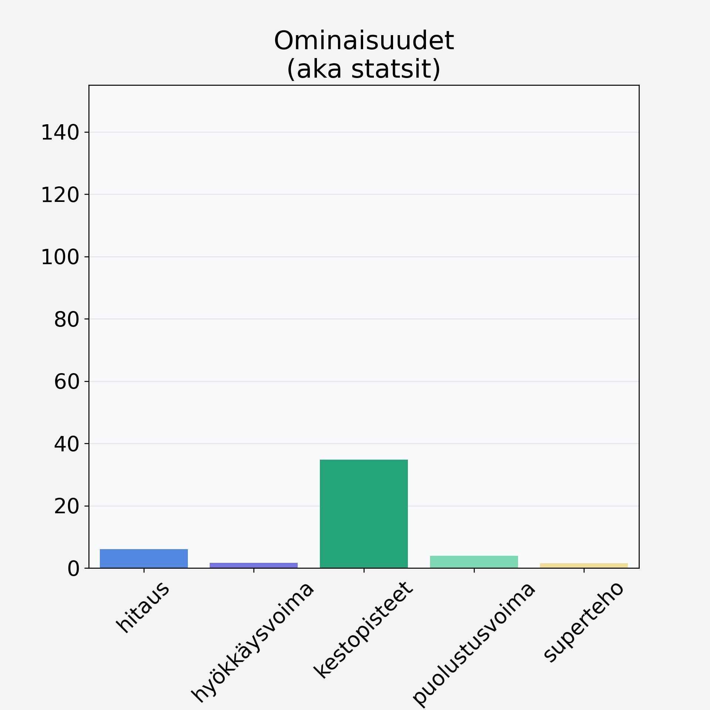

# Parsakaali, brokkoli

## Kilpailijan tiedot { data-search-exclude }

:octicons-shield-check-24:{ .shieldMarker } Kilpailija on Finelin hyväksymä.

{ loading=lazy }

## Lisätiedot { data-search-exclude }
=== "Statsit numeerisena"

     | Voima          |   Arvo |
     |:---------------|-------:|
     | hitaus         |   6.07 |
     | hyökkäysvoima  |   1.64 |
     | kestopisteet   |  34.82 |
     | puolustusvoima |   3.9  |
     | superteho      |   1.49 |

=== "Samankaltaisia kilpailijoita"
    [Kukkakaali](/kukkakaali){ .md-button .md-button--primary .similarProduct }
    [Lehtikaali](/lehtikaali){ .md-button .md-button--primary .similarProduct }
    [Kyssäkaali, kaalirapi](/kyssakaali-kaalirapi){ .md-button .md-button--primary .similarProduct }
    [Kiinankaali](/kiinankaali){ .md-button .md-button--primary .similarProduct }
    [Valkokaali, keräkaali](/valkokaali-kerakaali){ .md-button .md-button--primary .similarProduct }

!!! info inline start "Huomio"

    Hyökkäysvoima vaihtelee eri sotureilla :)
