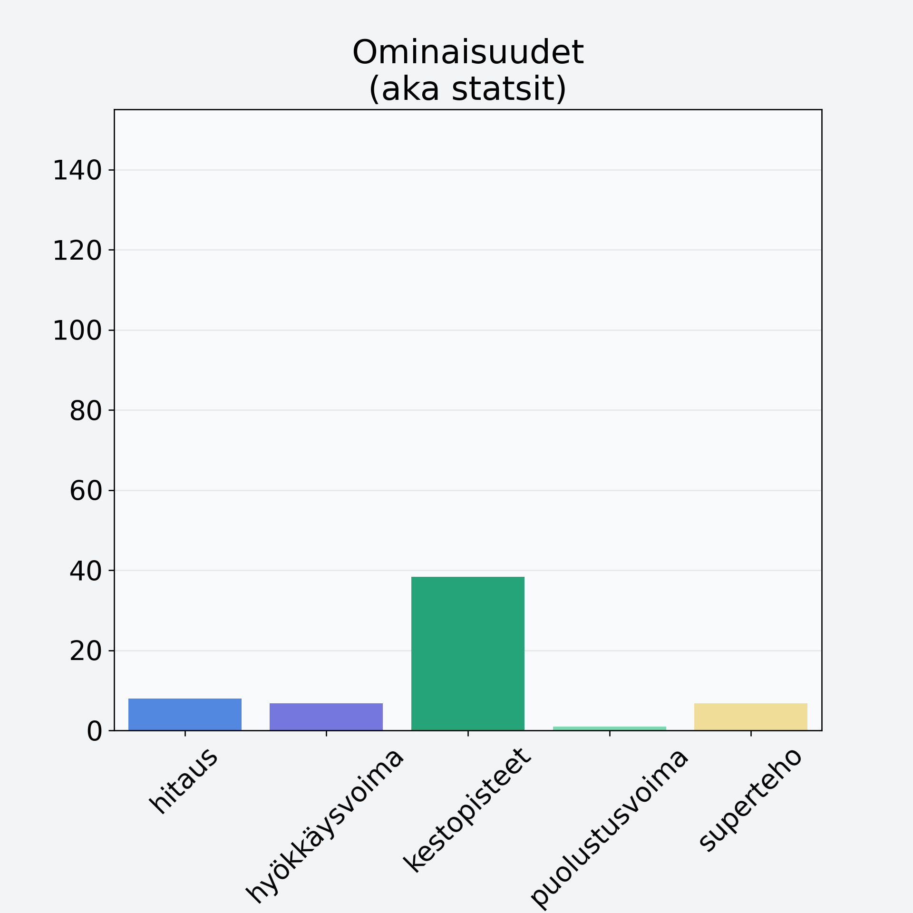

# Persikka/nektariini, keskiarvo, punnittu kivineen

## Kilpailijan tiedot { data-search-exclude }

:octicons-shield-check-24:{ .shieldMarker } Kilpailija on Finelin hyväksymä.

{ loading=lazy }

## Lisätiedot { data-search-exclude }
=== "Statsit numeerisena"

     | Voima          |   Arvo |
     |:---------------|-------:|
     | hitaus         |   7.98 |
     | hyökkäysvoima  |   6.79 |
     | kestopisteet   |  38.32 |
     | puolustusvoima |   1    |
     | superteho      |   6.79 |

=== "Samankaltaisia kilpailijoita"
    [Persikka/nektariini, kuorittu, kivetön](/persikka-nektariini-kuorittu-kiveton){ .md-button .md-button--primary .similarProduct }
    [Omena, kotimainen, kuorittu](/omena-kotimainen-kuorittu){ .md-button .md-button--primary .similarProduct }
    [Aprikoosi, keskiarvo, punnittu kivineen](/aprikoosi-keskiarvo-punnittu-kivineen){ .md-button .md-button--primary .similarProduct }
    [Luumu, tumma, punnittu kivineen](/luumu-tumma-punnittu-kivineen){ .md-button .md-button--primary .similarProduct }
    [Päärynä, punnittu kuorineen](/paaryna-punnittu-kuorineen){ .md-button .md-button--primary .similarProduct }

!!! info inline start "Huomio"

    Hyökkäysvoima vaihtelee eri sotureilla :)
