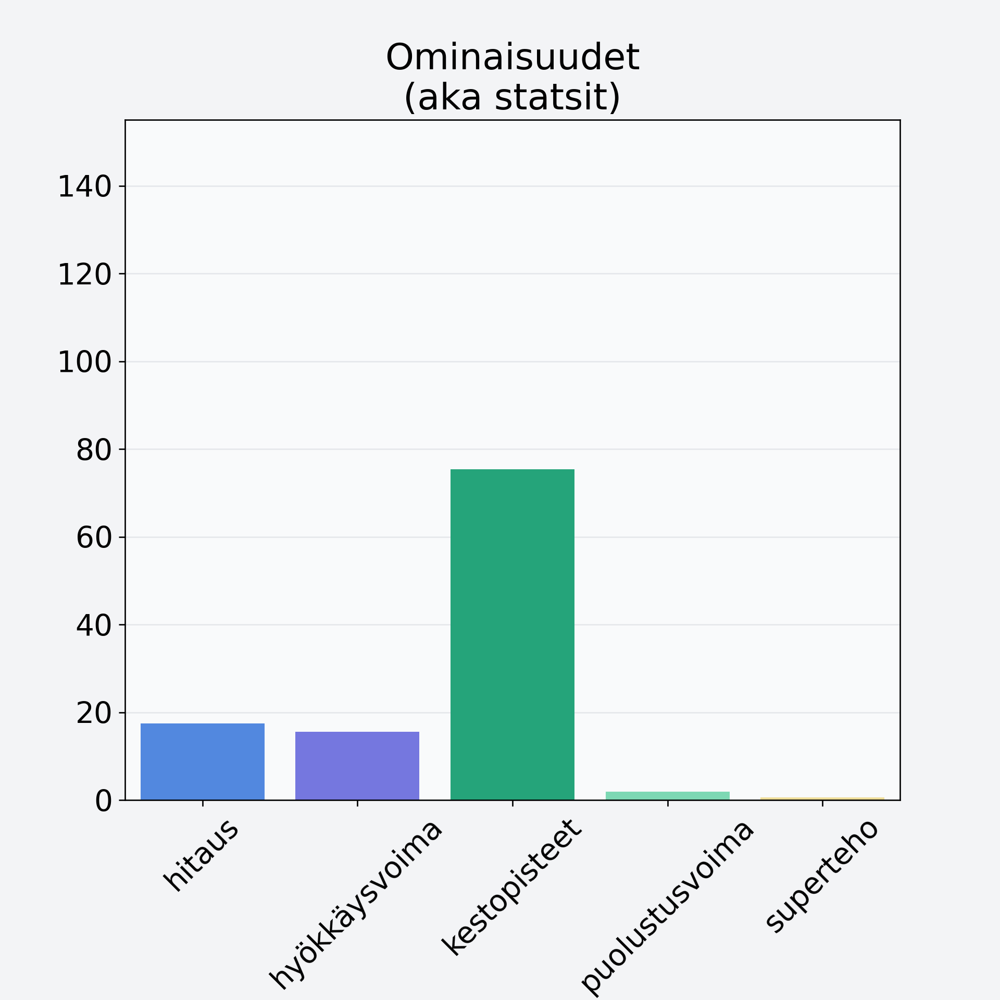

# Peruna, kuorittu, suurtaloustuote, suojakaasupakattu

## Kilpailijan tiedot { data-search-exclude }

:octicons-shield-check-24:{ .shieldMarker } Kilpailija on Finelin hyväksymä.

{ loading=lazy }

## Lisätiedot { data-search-exclude }
=== "Statsit numeerisena"

     | Voima          |   Arvo |
     |:---------------|-------:|
     | hitaus         |  17.49 |
     | hyökkäysvoima  |  15.5  |
     | kestopisteet   |  75.35 |
     | puolustusvoima |   1.88 |
     | superteho      |   0.6  |

=== "Samankaltaisia kilpailijoita"
    [Peruna, punnittu kuorineen](/peruna-punnittu-kuorineen){ .md-button .md-button--primary .similarProduct }

!!! info inline start "Huomio"

    Hyökkäysvoima vaihtelee eri sotureilla :)
