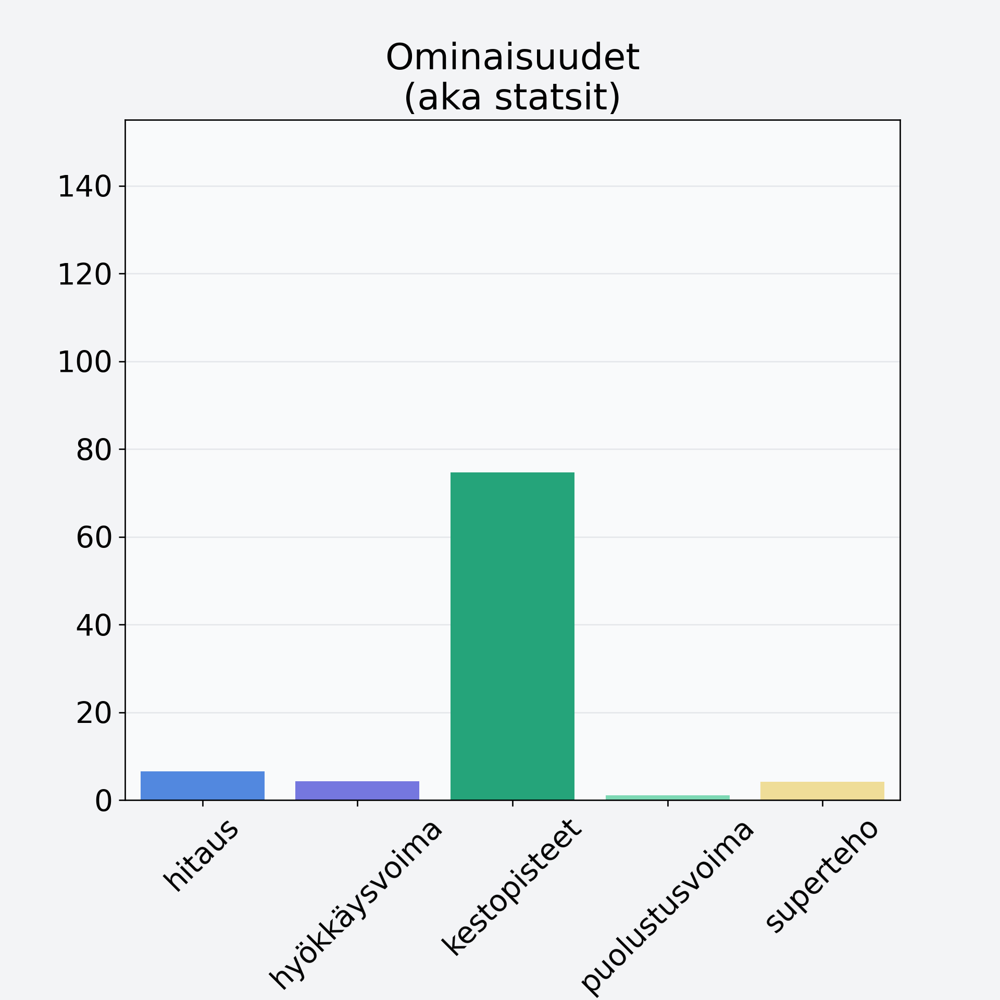

# Pihlajanmarja

## Kilpailijan tiedot { data-search-exclude }

:octicons-shield-check-24:{ .shieldMarker } Kilpailija on Finelin hyväksymä.

{ loading=lazy }

## Lisätiedot { data-search-exclude }
=== "Statsit numeerisena"

     | Voima          |   Arvo |
     |:---------------|-------:|
     | hitaus         |   6.53 |
     | hyökkäysvoima  |   4.25 |
     | kestopisteet   |  74.7  |
     | puolustusvoima |   1.1  |
     | superteho      |   4.1  |

=== "Samankaltaisia kilpailijoita"
    [Sorbetti, vadelmasorbetti, teollinen](/sorbetti-vadelmasorbetti-teollinen){ .md-button .md-button--primary .similarProduct }
    [Mustikka, metsämustikka](/mustikka-metsamustikka){ .md-button .md-button--primary .similarProduct }
    [Variksenmarja](/variksenmarja){ .md-button .md-button--primary .similarProduct }
    [Marja, keskiarvo](/marja-keskiarvo){ .md-button .md-button--primary .similarProduct }
    [Katajanmarja](/katajanmarja){ .md-button .md-button--primary .similarProduct }
    [Mustikka, pensasmustikka](/mustikka-pensasmustikka){ .md-button .md-button--primary .similarProduct }

!!! info inline start "Huomio"

    Hyökkäysvoima vaihtelee eri sotureilla :)
