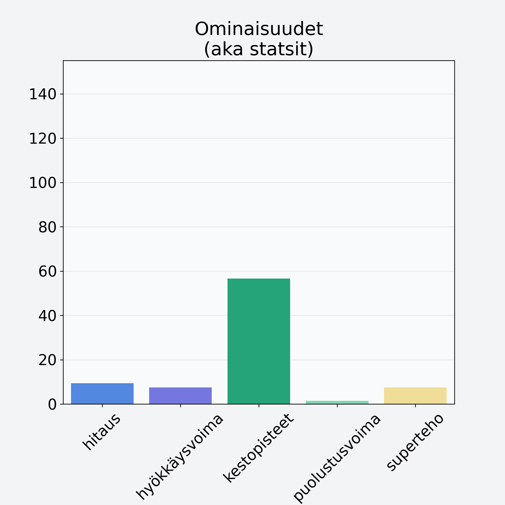

# Punaherukka

## Kilpailijan tiedot { data-search-exclude }

:octicons-shield-check-24:{ .shieldMarker } Kilpailija on Finelin hyväksymä.

{ loading=lazy }

## Lisätiedot { data-search-exclude }
=== "Statsit numeerisena"

     | Voima          |   Arvo |
     |:---------------|-------:|
     | hitaus         |   9.34 |
     | hyökkäysvoima  |   7.5  |
     | kestopisteet   |  56.66 |
     | puolustusvoima |   1.44 |
     | superteho      |   7.5  |

=== "Samankaltaisia kilpailijoita"
    [Tyrnimarja, kuivattu, tyrnimarjajauhe](/tyrnimarja-kuivattu-tyrnimarjajauhe){ .md-button .md-button--primary .similarProduct }
    [Marja, keskiarvo](/marja-keskiarvo){ .md-button .md-button--primary .similarProduct }

!!! info inline start "Huomio"

    Hyökkäysvoima vaihtelee eri sotureilla :)
