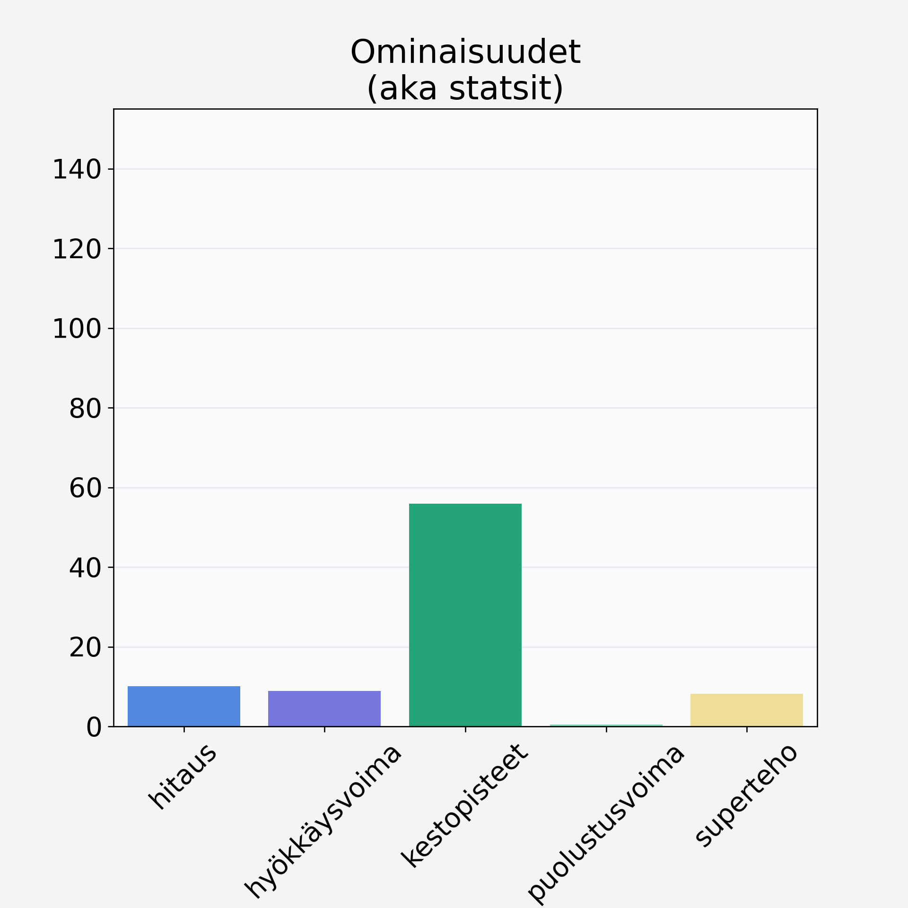

# Puolukka

## Kilpailijan tiedot { data-search-exclude }

:octicons-shield-check-24:{ .shieldMarker } Kilpailija on Finelin hyväksymä.

{ loading=lazy }

## Lisätiedot { data-search-exclude }
=== "Statsit numeerisena"

     | Voima          |   Arvo |
     |:---------------|-------:|
     | hitaus         |  10.05 |
     | hyökkäysvoima  |   8.86 |
     | kestopisteet   |  55.86 |
     | puolustusvoima |   0.53 |
     | superteho      |   8.16 |

=== "Samankaltaisia kilpailijoita"
    [Mansikka](/mansikka){ .md-button .md-button--primary .similarProduct }
    [Juolukka](/juolukka){ .md-button .md-button--primary .similarProduct }
    [Punaherukka](/punaherukka){ .md-button .md-button--primary .similarProduct }

!!! info inline start "Huomio"

    Hyökkäysvoima vaihtelee eri sotureilla :)
