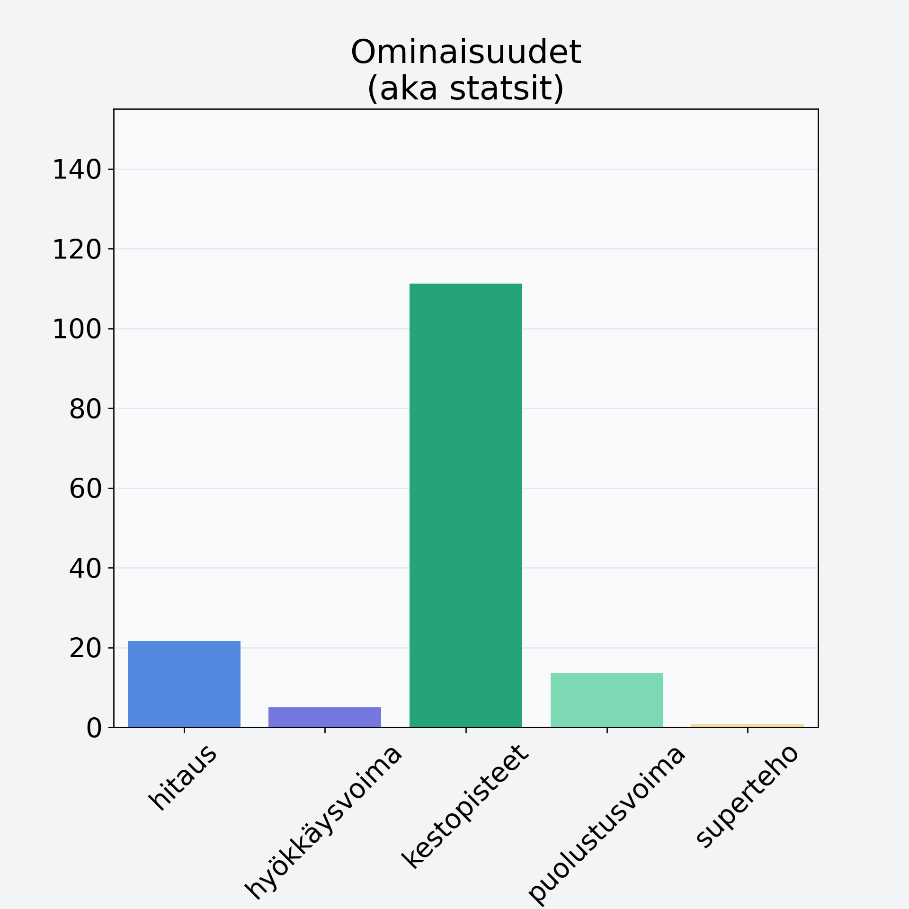

# Quorn, fileet, kuutiot, rouhe

## Kilpailijan tiedot { data-search-exclude }

:octicons-shield-check-24:{ .shieldMarker } Kilpailija on Finelin hyväksymä.

{ loading=lazy }

## Lisätiedot { data-search-exclude }
=== "Statsit numeerisena"

     | Voima          |   Arvo |
     |:---------------|-------:|
     | hitaus         |  21.65 |
     | hyökkäysvoima  |   5    |
     | kestopisteet   | 111.25 |
     | puolustusvoima |  13.7  |
     | superteho      |   0.8  |

=== "Samankaltaisia kilpailijoita"
    [Kangasrousku](/kangasrousku){ .md-button .md-button--primary .similarProduct }
    [Osterivinokas](/osterivinokas){ .md-button .md-button--primary .similarProduct }
    [Etikkasienisäilyke](/etikkasienisailyke){ .md-button .md-button--primary .similarProduct }
    [Siitakesieni](/siitakesieni){ .md-button .md-button--primary .similarProduct }

!!! info inline start "Huomio"

    Hyökkäysvoima vaihtelee eri sotureilla :)
