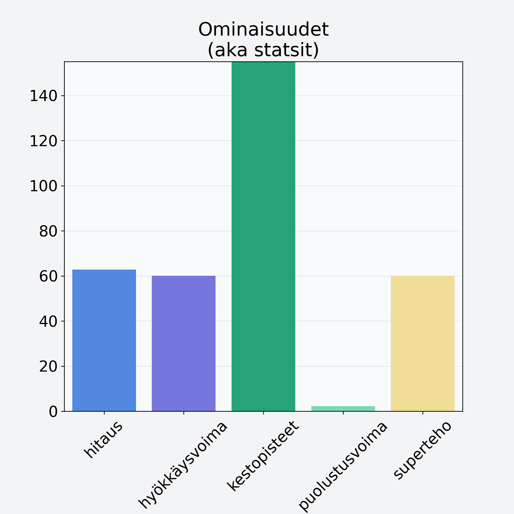

# Rusina

## Kilpailijan tiedot { data-search-exclude }

:octicons-shield-check-24:{ .shieldMarker } Kilpailija on Finelin hyväksymä.

{ loading=lazy }

## Lisätiedot { data-search-exclude }
=== "Statsit numeerisena"

     | Voima          |   Arvo |
     |:---------------|-------:|
     | hitaus         |  62.82 |
     | hyökkäysvoima  |  60.1  |
     | kestopisteet   | 290.01 |
     | puolustusvoima |   2.22 |
     | superteho      |  60.1  |

=== "Samankaltaisia kilpailijoita"
    [Rusina](/rusina){ .md-button .md-button--primary .similarProduct }
    [Viikuna, kuivattu](/viikuna-kuivattu){ .md-button .md-button--primary .similarProduct }
    [Kiivi, kuorittu](/kiivi-kuorittu){ .md-button .md-button--primary .similarProduct }
    [Vesimeloni, kuorittu](/vesimeloni-kuorittu){ .md-button .md-button--primary .similarProduct }
    [Avokado, kuorittu, kivetön](/avokado-kuorittu-kiveton){ .md-button .md-button--primary .similarProduct }

!!! info inline start "Huomio"

    Hyökkäysvoima vaihtelee eri sotureilla :)
