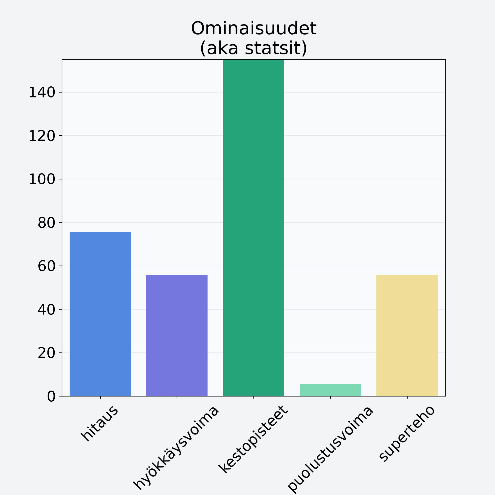

# Suklaarusina

## Kilpailijan tiedot { data-search-exclude }

:octicons-shield-check-24:{ .shieldMarker } Kilpailija on Finelin hyväksymä.

{ loading=lazy }

## Lisätiedot { data-search-exclude }
=== "Statsit numeerisena"

     | Voima          |   Arvo |
     |:---------------|-------:|
     | hitaus         |  75.47 |
     | hyökkäysvoima  |  55.78 |
     | kestopisteet   | 395.33 |
     | puolustusvoima |   5.54 |
     | superteho      |  55.78 |

=== "Samankaltaisia kilpailijoita"
    [Ananas, tuore, punnittu kuorineen](/ananas-tuore-punnittu-kuorineen){ .md-button .md-button--primary .similarProduct }
    [Hunajameloni, kuorittu](/hunajameloni-kuorittu){ .md-button .md-button--primary .similarProduct }

!!! info inline start "Huomio"

    Hyökkäysvoima vaihtelee eri sotureilla :)
