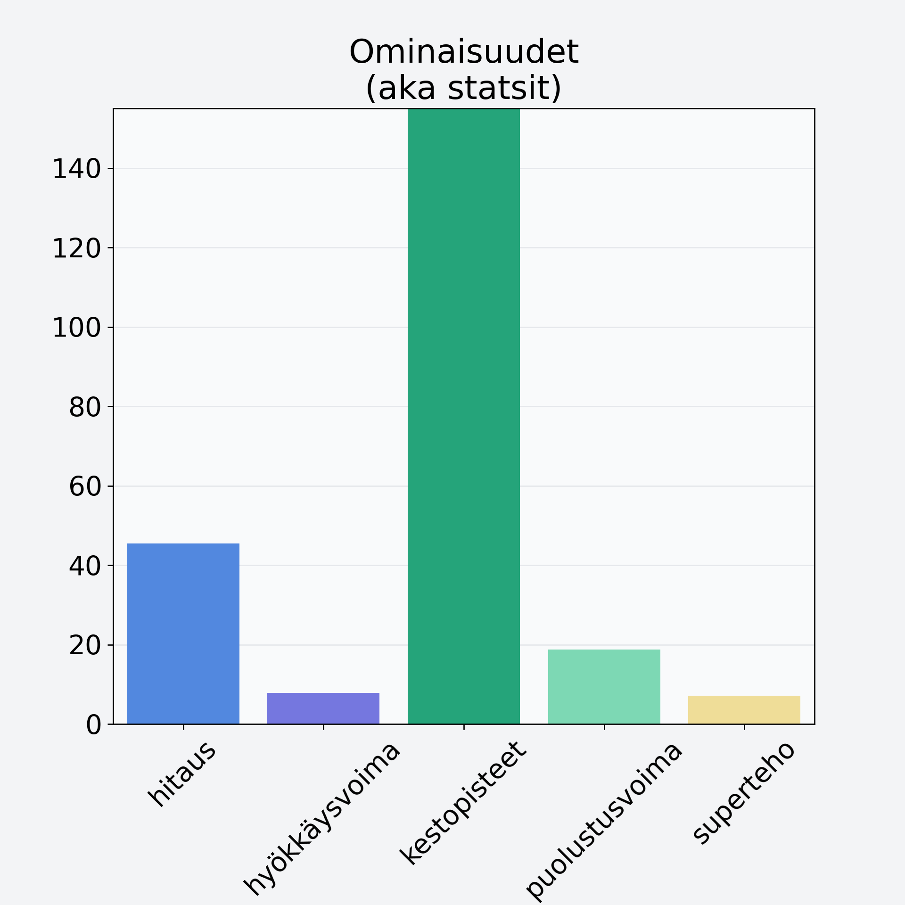

# Tyrnimarja, kuivattu, tyrnimarjajauhe

## Kilpailijan tiedot { data-search-exclude }

:octicons-shield-check-24:{ .shieldMarker } Kilpailija on Finelin hyväksymä.

{ loading=lazy }

## Lisätiedot { data-search-exclude }
=== "Statsit numeerisena"

     | Voima          |   Arvo |
     |:---------------|-------:|
     | hitaus         |  45.47 |
     | hyökkäysvoima  |   7.87 |
     | kestopisteet   | 365.38 |
     | puolustusvoima |  18.8  |
     | superteho      |   7.17 |

=== "Samankaltaisia kilpailijoita"
    [Karpalo, kuivattu, karpalojauhe](/karpalo-kuivattu-karpalojauhe){ .md-button .md-button--primary .similarProduct }
    [Juolukka](/juolukka){ .md-button .md-button--primary .similarProduct }
    [Variksenmarja](/variksenmarja){ .md-button .md-button--primary .similarProduct }

!!! info inline start "Huomio"

    Hyökkäysvoima vaihtelee eri sotureilla :)
