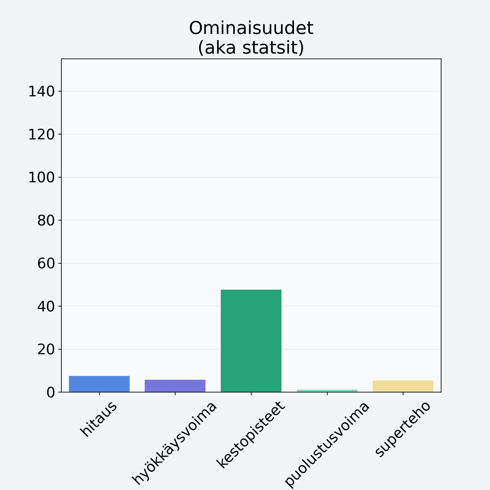

# Vadelma

## Kilpailijan tiedot { data-search-exclude }

:octicons-shield-check-24:{ .shieldMarker } Kilpailija on Finelin hyväksymä.

{ loading=lazy }

## Lisätiedot { data-search-exclude }
=== "Statsit numeerisena"

     | Voima          |   Arvo |
     |:---------------|-------:|
     | hitaus         |   7.51 |
     | hyökkäysvoima  |   5.71 |
     | kestopisteet   |  47.61 |
     | puolustusvoima |   1.01 |
     | superteho      |   5.29 |

=== "Samankaltaisia kilpailijoita"
    [Karpalo, kuivattu, karpalojauhe](/karpalo-kuivattu-karpalojauhe){ .md-button .md-button--primary .similarProduct }
    [Vadelma](/vadelma){ .md-button .md-button--primary .similarProduct }
    [Marja-aronia](/marja-aronia){ .md-button .md-button--primary .similarProduct }
    [Ruusunmarja, kuivattu, ruusunmarjajauhe](/ruusunmarja-kuivattu-ruusunmarjajauhe){ .md-button .md-button--primary .similarProduct }
    [Lakka, suomuurain, hilla](/lakka-suomuurain-hilla){ .md-button .md-button--primary .similarProduct }

!!! info inline start "Huomio"

    Hyökkäysvoima vaihtelee eri sotureilla :)
