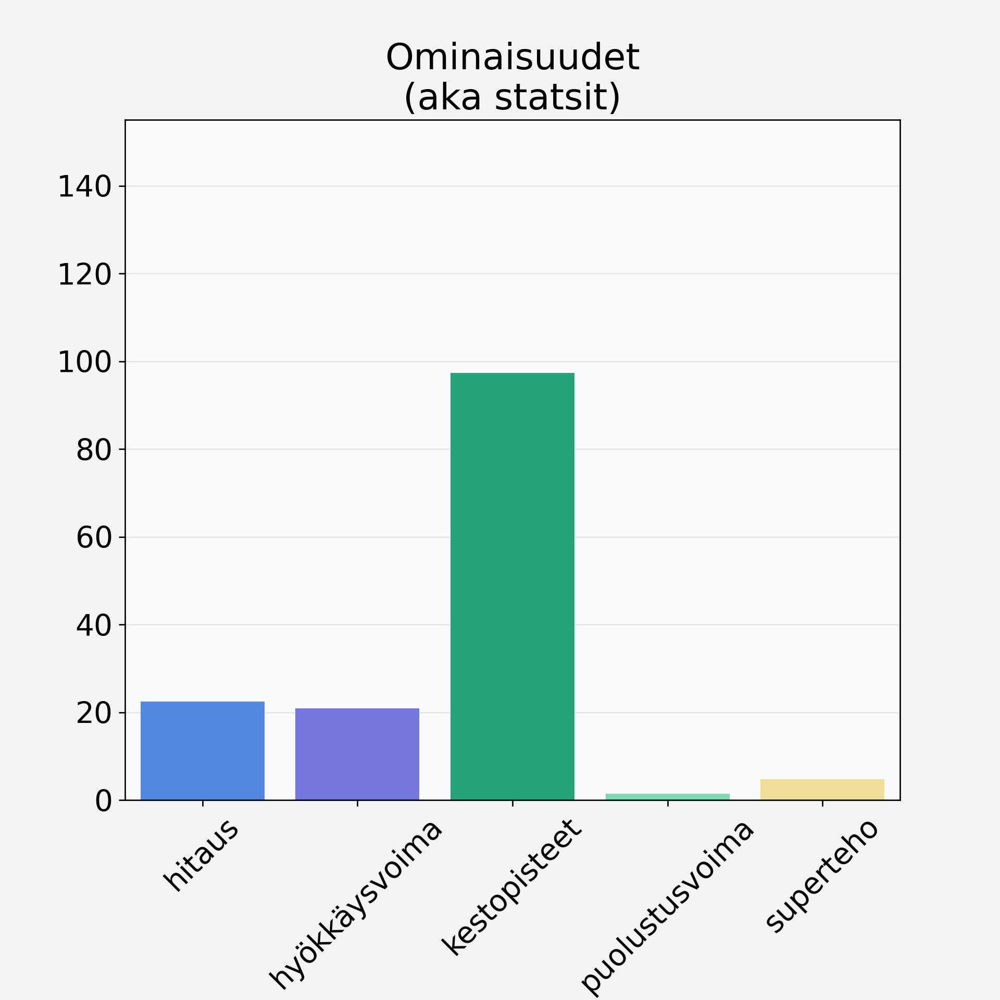

# Vesikastanja

## Kilpailijan tiedot { data-search-exclude }

:octicons-shield-check-24:{ .shieldMarker } Kilpailija on Finelin hyväksymä.

{ loading=lazy }

## Lisätiedot { data-search-exclude }
=== "Statsit numeerisena"

     | Voima          |   Arvo |
     |:---------------|-------:|
     | hitaus         |  22.44 |
     | hyökkäysvoima  |  20.94 |
     | kestopisteet   |  97.39 |
     | puolustusvoima |   1.4  |
     | superteho      |   4.8  |

=== "Samankaltaisia kilpailijoita"
    [Valkoretikka](/valkoretikka){ .md-button .md-button--primary .similarProduct }
    [Inkivääri, juurakko, raaka](/inkivaari-juurakko-raaka){ .md-button .md-button--primary .similarProduct }
    [Lanttu](/lanttu){ .md-button .md-button--primary .similarProduct }

!!! info inline start "Huomio"

    Hyökkäysvoima vaihtelee eri sotureilla :)
