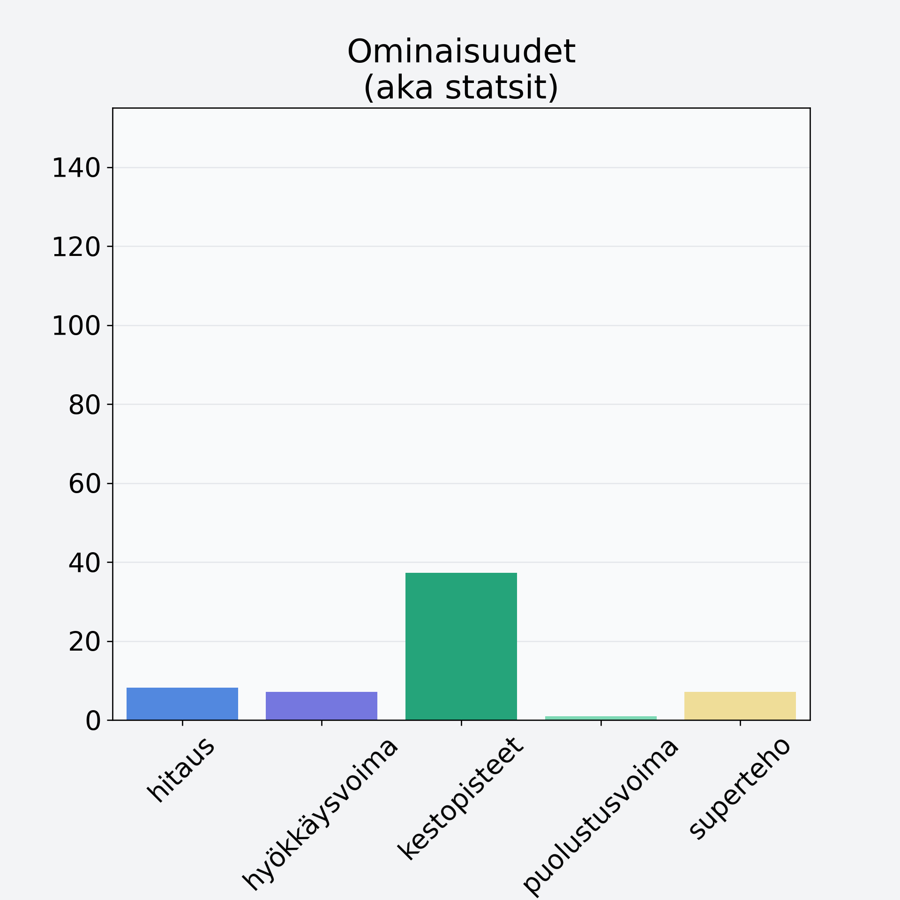

# Vesimeloni, kuorittu

## Kilpailijan tiedot { data-search-exclude }

:octicons-shield-check-24:{ .shieldMarker } Kilpailija on Finelin hyväksymä.

{ loading=lazy }

## Lisätiedot { data-search-exclude }
=== "Statsit numeerisena"

     | Voima          |   Arvo |
     |:---------------|-------:|
     | hitaus         |   8.16 |
     | hyökkäysvoima  |   7.1  |
     | kestopisteet   |  37.22 |
     | puolustusvoima |   0.91 |
     | superteho      |   7.1  |

=== "Samankaltaisia kilpailijoita"
    [Erikoishedelmä, eksoottinen, keskiarvo, mango/papaija, kuivattu](/erikoishedelma-eksoottinen-keskiarvo-mango-papaija-kuivattu){ .md-button .md-button--primary .similarProduct }
    [Banaani, punnittu kuorineen](/banaani-punnittu-kuorineen){ .md-button .md-button--primary .similarProduct }
    [Papaija, kuivattu](/papaija-kuivattu){ .md-button .md-button--primary .similarProduct }

!!! info inline start "Huomio"

    Hyökkäysvoima vaihtelee eri sotureilla :)
