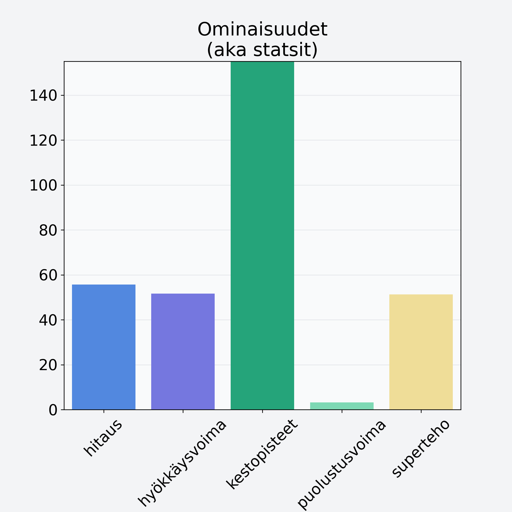

# Viikuna, kuivattu, punnittu kantoineen

## Kilpailijan tiedot { data-search-exclude }

:octicons-shield-check-24:{ .shieldMarker } Kilpailija on Finelin hyväksymä.

{ loading=lazy }

## Lisätiedot { data-search-exclude }
=== "Statsit numeerisena"

     | Voima          |   Arvo |
     |:---------------|-------:|
     | hitaus         |  55.7  |
     | hyökkäysvoima  |  51.6  |
     | kestopisteet   | 247.9  |
     | puolustusvoima |   3.2  |
     | superteho      |  51.31 |

=== "Samankaltaisia kilpailijoita"
    [Banaanilastu, kuivattu banaani, jogurttikuorrutus](/banaanilastu-kuivattu-banaani-jogurttikuorrutus){ .md-button .md-button--primary .similarProduct }
    [Banaani, punnittu kuorineen](/banaani-punnittu-kuorineen){ .md-button .md-button--primary .similarProduct }
    [Välipalapatukka, raakapatukka, bare bar, viljaton](/valipalapatukka-raakapatukka-bare-bar-viljaton){ .md-button .md-button--primary .similarProduct }

!!! info inline start "Huomio"

    Hyökkäysvoima vaihtelee eri sotureilla :)
