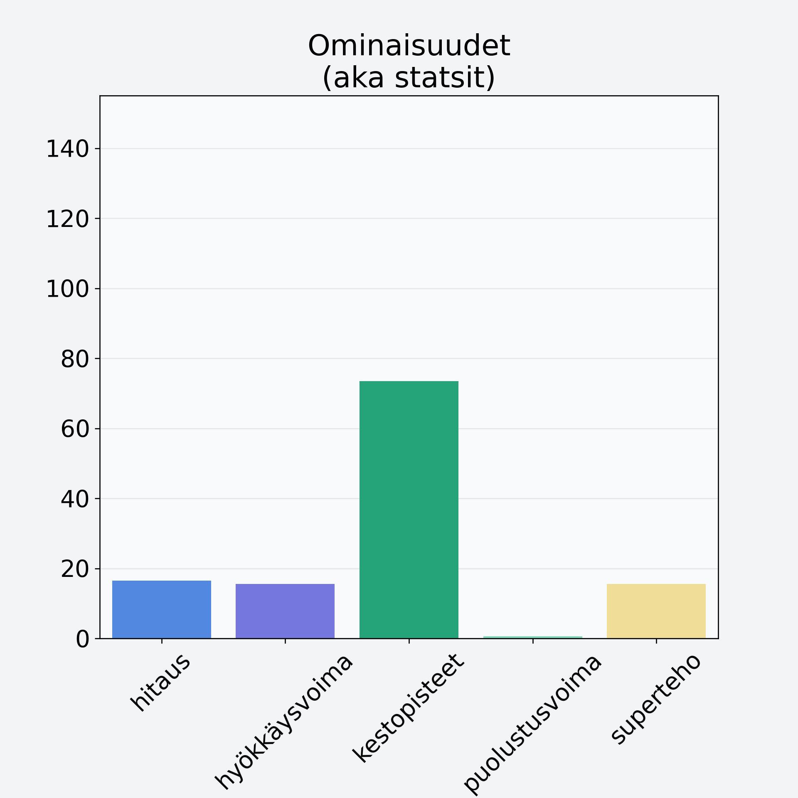

# Viinirypäle, keskiarvo, kivetön, vihreä/tumma

## Kilpailijan tiedot { data-search-exclude }

:octicons-shield-check-24:{ .shieldMarker } Kilpailija on Finelin hyväksymä.

{ loading=lazy }

## Lisätiedot { data-search-exclude }
=== "Statsit numeerisena"

     | Voima          |   Arvo |
     |:---------------|-------:|
     | hitaus         |  16.5  |
     | hyökkäysvoima  |  15.5  |
     | kestopisteet   |  73.54 |
     | puolustusvoima |   0.6  |
     | superteho      |  15.5  |

=== "Samankaltaisia kilpailijoita"
    [Oliivi, keskiarvo, kivetön, suolaliemessä, vihreä](/oliivi-keskiarvo-kiveton-suolaliemessa-vihrea){ .md-button .md-button--primary .similarProduct }
    [Viinirypäle, keskiarvo, punnittu kivineen, vihreä/tumma](/viinirypale-keskiarvo-punnittu-kivineen-vihrea-tumma){ .md-button .md-button--primary .similarProduct }
    [Ananas, kuivattu, jogurttikuorrutus](/ananas-kuivattu-jogurttikuorrutus){ .md-button .md-button--primary .similarProduct }
    [Eksoottinen hedelmä, keskiarvo, mango/papaija, kuorittu](/eksoottinen-hedelma-keskiarvo-mango-papaija-kuorittu){ .md-button .md-button--primary .similarProduct }
    [Välipalapatukka, raakapatukka, bare bar, viljaton](/valipalapatukka-raakapatukka-bare-bar-viljaton){ .md-button .md-button--primary .similarProduct }
    [Papaija, kuivattu](/papaija-kuivattu){ .md-button .md-button--primary .similarProduct }

!!! info inline start "Huomio"

    Hyökkäysvoima vaihtelee eri sotureilla :)
