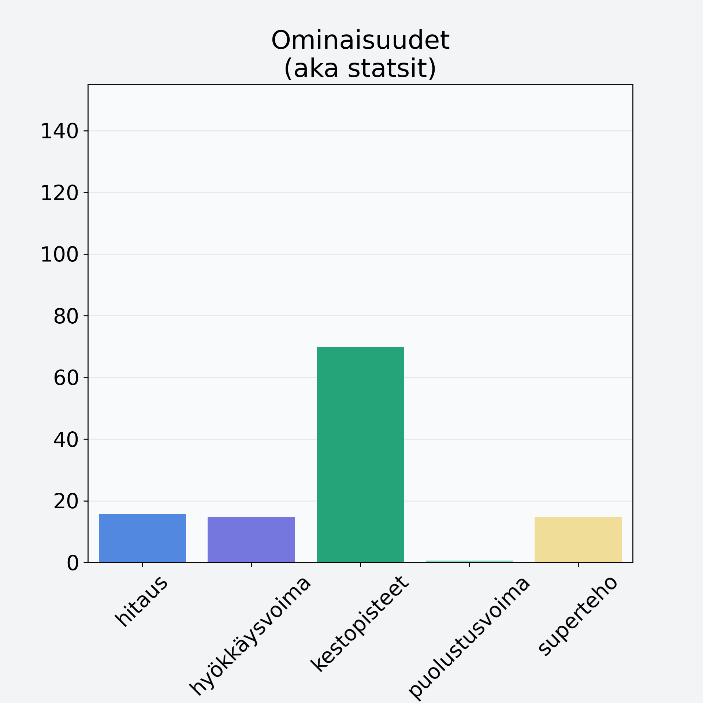

# Viinirypäle, keskiarvo, punnittu kivineen, vihreä/tumma

## Kilpailijan tiedot { data-search-exclude }

:octicons-shield-check-24:{ .shieldMarker } Kilpailija on Finelin hyväksymä.

{ loading=lazy }

## Lisätiedot { data-search-exclude }
=== "Statsit numeerisena"

     | Voima          |   Arvo |
     |:---------------|-------:|
     | hitaus         |  15.67 |
     | hyökkäysvoima  |  14.72 |
     | kestopisteet   |  69.87 |
     | puolustusvoima |   0.57 |
     | superteho      |  14.72 |

=== "Samankaltaisia kilpailijoita"
    [Banaani, punnittu kuorineen](/banaani-punnittu-kuorineen){ .md-button .md-button--primary .similarProduct }
    [Ananas, kuorittu](/ananas-kuorittu){ .md-button .md-button--primary .similarProduct }
    [Papaija, kuivattu](/papaija-kuivattu){ .md-button .md-button--primary .similarProduct }
    [Passionhedelmä](/passionhedelma){ .md-button .md-button--primary .similarProduct }
    [Oliivi, keskiarvo, kivetön, öljyssä, vihreä/musta](/oliivi-keskiarvo-kiveton-oljyssa-vihrea-musta){ .md-button .md-button--primary .similarProduct }

!!! info inline start "Huomio"

    Hyökkäysvoima vaihtelee eri sotureilla :)
