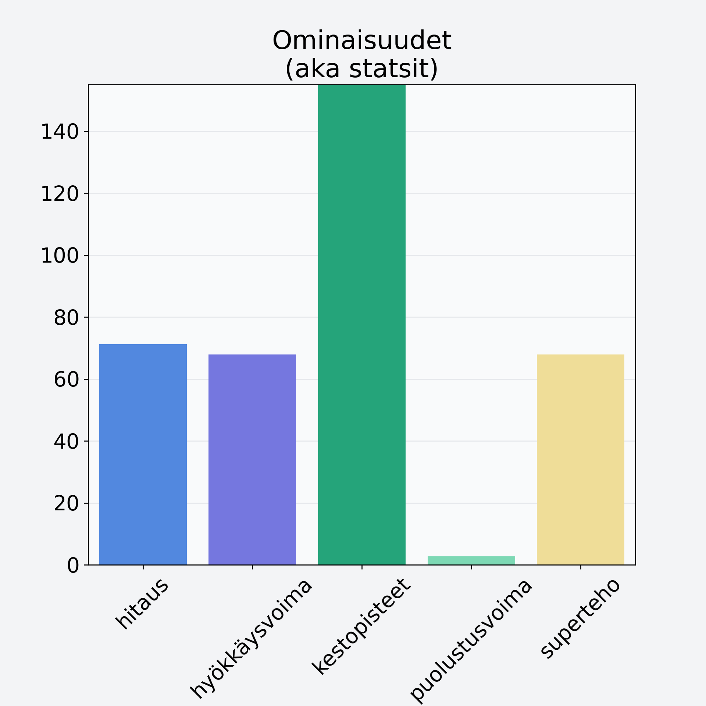

# Ananas, kuivattu

## Kilpailijan tiedot { data-search-exclude }

:octicons-shield-check-24:{ .shieldMarker } Kilpailija on Finelin hyväksymä.

{ loading=lazy }

## Lisätiedot { data-search-exclude }
=== "Statsit numeerisena"

     | Voima          |   Arvo |
     |:---------------|-------:|
     | hitaus         |  71.27 |
     | hyökkäysvoima  |  67.9  |
     | kestopisteet   | 307.93 |
     | puolustusvoima |   2.76 |
     | superteho      |  67.9  |

=== "Samankaltaisia kilpailijoita"
    [Suklaarusina](/suklaarusina){ .md-button .md-button--primary .similarProduct }
    [Mango, kuivattu](/mango-kuivattu){ .md-button .md-button--primary .similarProduct }

!!! info inline start "Huomio"

    Hyökkäysvoima vaihtelee eri sotureilla :)
