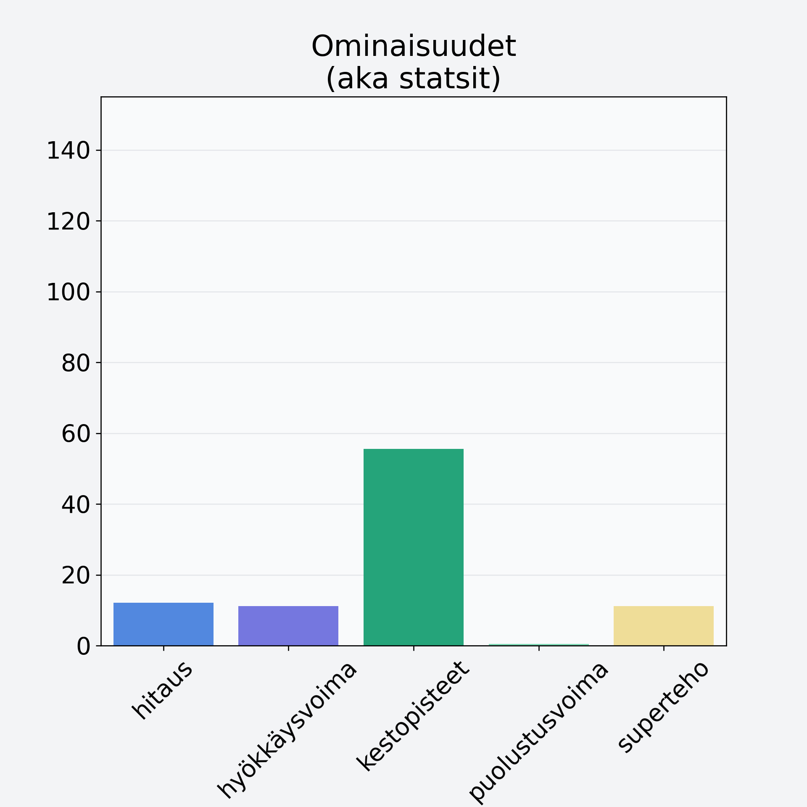

# Ananas, kuorittu

## Kilpailijan tiedot { data-search-exclude }

:octicons-shield-check-24:{ .shieldMarker } Kilpailija on Finelin hyväksymä.

{ loading=lazy }

## Lisätiedot { data-search-exclude }
=== "Statsit numeerisena"

     | Voima          |   Arvo |
     |:---------------|-------:|
     | hitaus         |  12.1  |
     | hyökkäysvoima  |  11.2  |
     | kestopisteet   |  55.62 |
     | puolustusvoima |   0.5  |
     | superteho      |  11.2  |

=== "Samankaltaisia kilpailijoita"
    [Taateli, kuivattu, punnittu kivineen](/taateli-kuivattu-punnittu-kivineen){ .md-button .md-button--primary .similarProduct }
    [Viinirypäle, keskiarvo, punnittu kivineen, vihreä/tumma](/viinirypale-keskiarvo-punnittu-kivineen-vihrea-tumma){ .md-button .md-button--primary .similarProduct }
    [Granaattiomena, kuorittu](/granaattiomena-kuorittu){ .md-button .md-button--primary .similarProduct }

!!! info inline start "Huomio"

    Hyökkäysvoima vaihtelee eri sotureilla :)
