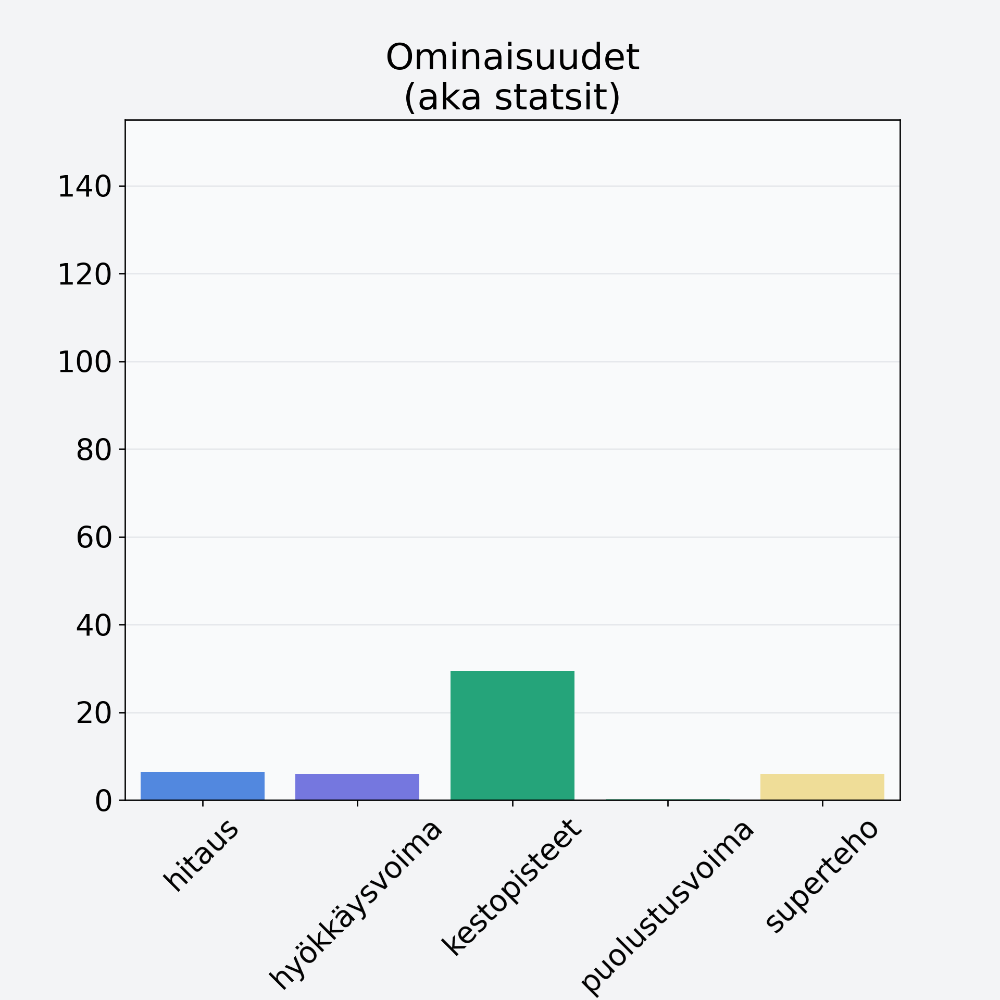

# Ananas, tuore, punnittu kuorineen

## Kilpailijan tiedot { data-search-exclude }

:octicons-shield-check-24:{ .shieldMarker } Kilpailija on Finelin hyväksymä.

{ loading=lazy }

## Lisätiedot { data-search-exclude }
=== "Statsit numeerisena"

     | Voima          |   Arvo |
     |:---------------|-------:|
     | hitaus         |   6.42 |
     | hyökkäysvoima  |   5.94 |
     | kestopisteet   |  29.48 |
     | puolustusvoima |   0.27 |
     | superteho      |   5.94 |

=== "Samankaltaisia kilpailijoita"
    [Banaanilastu, kuivattu banaani](/banaanilastu-kuivattu-banaani){ .md-button .md-button--primary .similarProduct }
    [Taateli, kuivattu, punnittu kivineen](/taateli-kuivattu-punnittu-kivineen){ .md-button .md-button--primary .similarProduct }
    [Meloni, verkkomeloni/cantaloupemeloni, kuorittu](/meloni-verkkomeloni-cantaloupemeloni-kuorittu){ .md-button .md-button--primary .similarProduct }
    [Mango, kuivattu](/mango-kuivattu){ .md-button .md-button--primary .similarProduct }
    [Kiivi, kuorittu](/kiivi-kuorittu){ .md-button .md-button--primary .similarProduct }
    [Sharon, kaki, persimon](/sharon-kaki-persimon){ .md-button .md-button--primary .similarProduct }

!!! info inline start "Huomio"

    Hyökkäysvoima vaihtelee eri sotureilla :)
