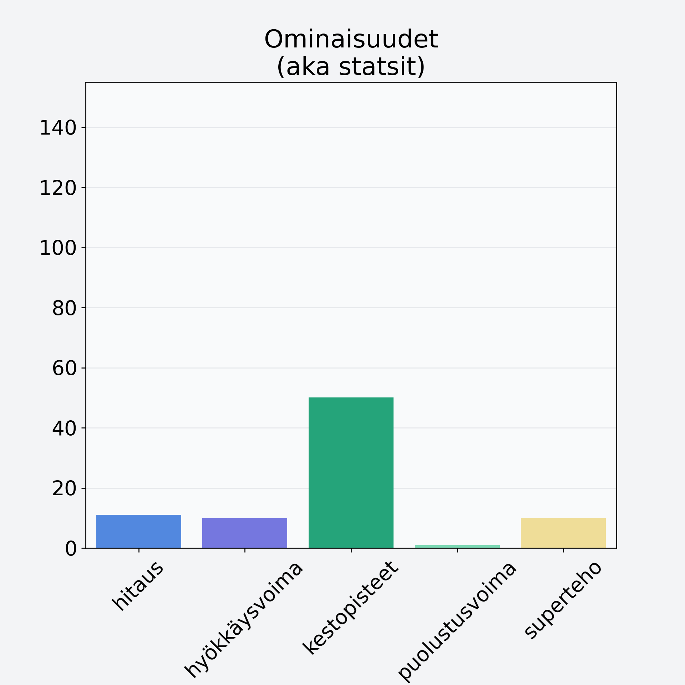

# Aprikoosi, keskiarvo, punnittu kivineen

## Kilpailijan tiedot { data-search-exclude }

:octicons-shield-check-24:{ .shieldMarker } Kilpailija on Finelin hyväksymä.

{ loading=lazy }

## Lisätiedot { data-search-exclude }
=== "Statsit numeerisena"

     | Voima          |   Arvo |
     |:---------------|-------:|
     | hitaus         |  11.05 |
     | hyökkäysvoima  |   9.96 |
     | kestopisteet   |  50.07 |
     | puolustusvoima |   1    |
     | superteho      |   9.96 |

=== "Samankaltaisia kilpailijoita"
    [Persikka, kuivattu](/persikka-kuivattu){ .md-button .md-button--primary .similarProduct }
    [Päärynä, kuorittu](/paaryna-kuorittu){ .md-button .md-button--primary .similarProduct }

!!! info inline start "Huomio"

    Hyökkäysvoima vaihtelee eri sotureilla :)
