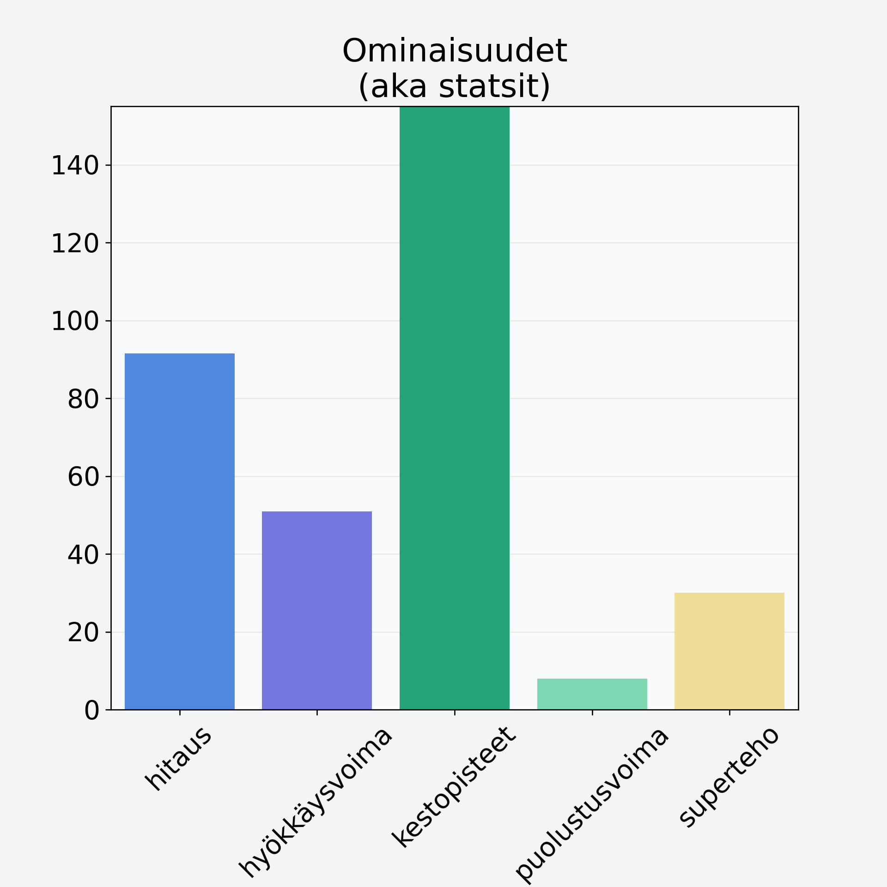

# Banaanilastu, kuivattu banaani, jogurttikuorrutus

## Kilpailijan tiedot { data-search-exclude }

:octicons-shield-check-24:{ .shieldMarker } Kilpailija on Finelin hyväksymä.

{ loading=lazy }

## Lisätiedot { data-search-exclude }
=== "Statsit numeerisena"

     | Voima          |   Arvo |
     |:---------------|-------:|
     | hitaus         |  91.58 |
     | hyökkäysvoima  |  50.92 |
     | kestopisteet   | 531.73 |
     | puolustusvoima |   7.92 |
     | superteho      |  30.01 |

=== "Samankaltaisia kilpailijoita"
    [Taateli, kuivattu, punnittu kivineen](/taateli-kuivattu-punnittu-kivineen){ .md-button .md-button--primary .similarProduct }
    [Banaani, kuorittu](/banaani-kuorittu){ .md-button .md-button--primary .similarProduct }
    [Ananas, kuorittu](/ananas-kuorittu){ .md-button .md-button--primary .similarProduct }
    [Avokado, kuorittu, kivetön](/avokado-kuorittu-kiveton){ .md-button .md-button--primary .similarProduct }

!!! info inline start "Huomio"

    Hyökkäysvoima vaihtelee eri sotureilla :)
