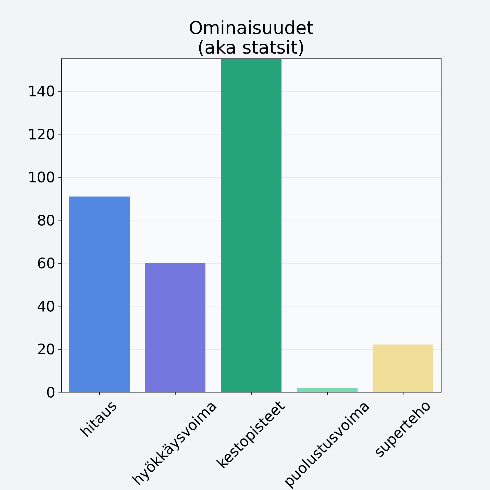

# Banaanilastu, kuivattu banaani

## Kilpailijan tiedot { data-search-exclude }

:octicons-shield-check-24:{ .shieldMarker } Kilpailija on Finelin hyväksymä.

{ loading=lazy }

## Lisätiedot { data-search-exclude }
=== "Statsit numeerisena"

     | Voima          |   Arvo |
     |:---------------|-------:|
     | hitaus         |   90.9 |
     | hyökkäysvoima  |   59.9 |
     | kestopisteet   |  513.7 |
     | puolustusvoima |    2   |
     | superteho      |   22.1 |

=== "Samankaltaisia kilpailijoita"
    [Kiivi, kuorittu](/kiivi-kuorittu){ .md-button .md-button--primary .similarProduct }
    [Avokado, kuorittu, kivetön](/avokado-kuorittu-kiveton){ .md-button .md-button--primary .similarProduct }
    [Kirsikka, punnittu kivineen](/kirsikka-punnittu-kivineen){ .md-button .md-button--primary .similarProduct }
    [Hunajameloni, punnittu kuorineen](/hunajameloni-punnittu-kuorineen){ .md-button .md-button--primary .similarProduct }
    [Oliivi, keskiarvo, kivetön, suolaliemessä, vihreä](/oliivi-keskiarvo-kiveton-suolaliemessa-vihrea){ .md-button .md-button--primary .similarProduct }

!!! info inline start "Huomio"

    Hyökkäysvoima vaihtelee eri sotureilla :)
