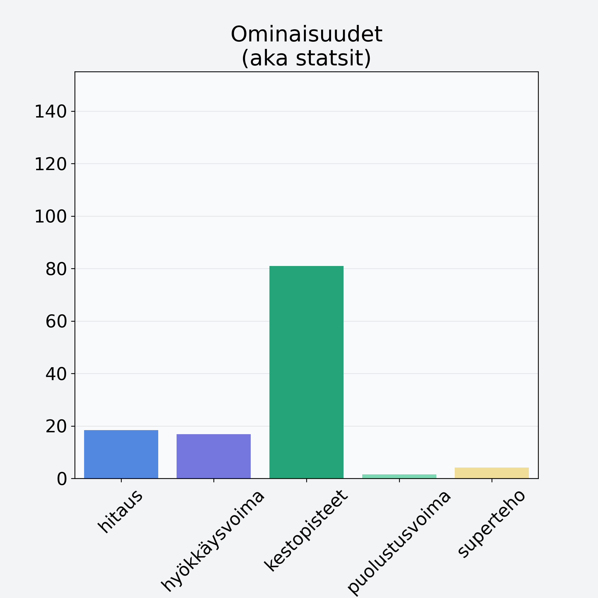

# Bataatti, kuorittu

## Kilpailijan tiedot { data-search-exclude }

:octicons-shield-check-24:{ .shieldMarker } Kilpailija on Finelin hyväksymä.

{ loading=lazy }

## Lisätiedot { data-search-exclude }
=== "Statsit numeerisena"

     | Voima          |   Arvo |
     |:---------------|-------:|
     | hitaus         |  18.45 |
     | hyökkäysvoima  |  16.83 |
     | kestopisteet   |  80.94 |
     | puolustusvoima |   1.57 |
     | superteho      |   4.18 |

=== "Samankaltaisia kilpailijoita"
    [Piparjuuri](/piparjuuri){ .md-button .md-button--primary .similarProduct }
    [Porkkana](/porkkana){ .md-button .md-button--primary .similarProduct }
    [Maa-artisokka](/maa-artisokka){ .md-button .md-button--primary .similarProduct }
    [Lanttu](/lanttu){ .md-button .md-button--primary .similarProduct }
    [Palsternakka](/palsternakka){ .md-button .md-button--primary .similarProduct }
    [Bataatti, kuorittu](/bataatti-kuorittu){ .md-button .md-button--primary .similarProduct }

!!! info inline start "Huomio"

    Hyökkäysvoima vaihtelee eri sotureilla :)
